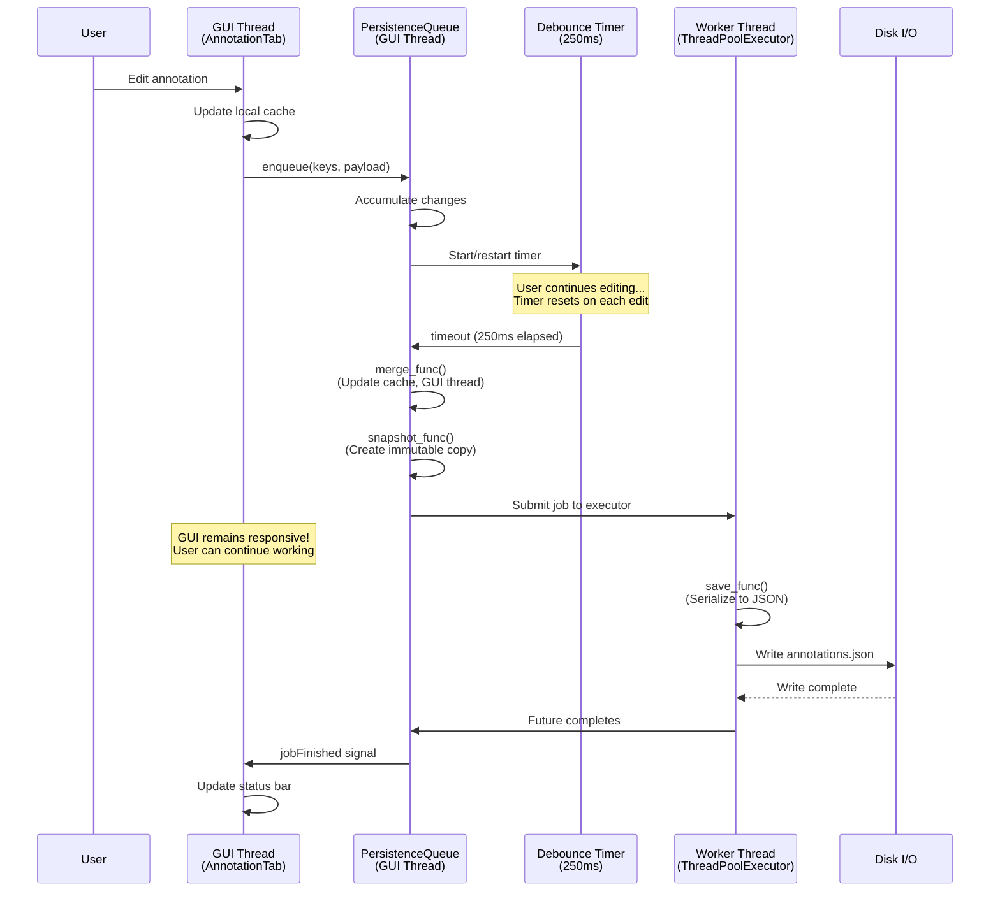
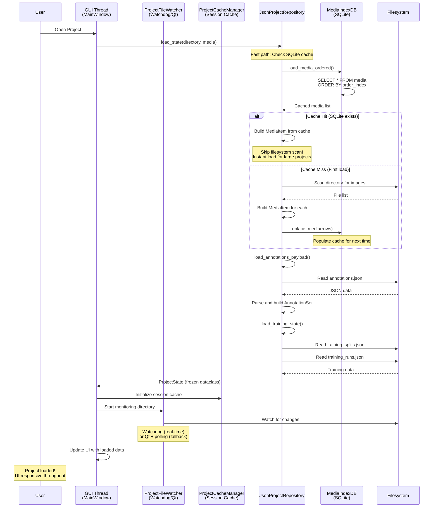
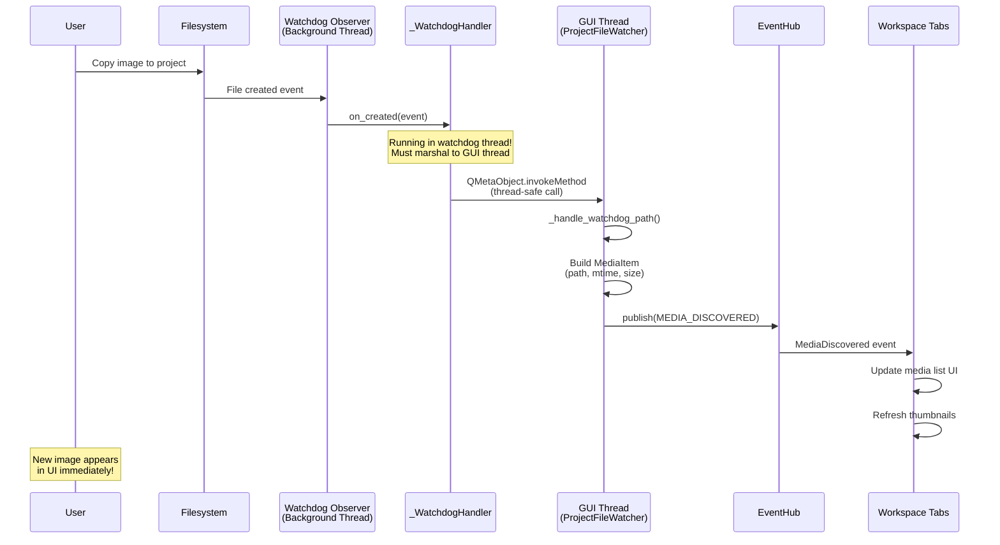

# DataLens Application Architecture - Mermaid Diagram

## Complete System Architecture

```mermaid
flowchart TB
    subgraph AppEntry["Application Entry"]
        APP[app.py main]
        DLAPP[DataLensApplication<br/>QApplication subclass]
        APP --> DLAPP
    end

    subgraph StartupSys["Startup System"]
        STARTUP_MGR[StartupManager<br/>Coordinates stages]
        STARTUP_DLG[StartupDialog<br/>Progress UI]
        STARTUP_MGR --> STARTUP_DLG
    end

    subgraph WelcomeSys["Welcome/Launcher System"]
        WELCOME[WelcomeWindow<br/>QDialog]
        PROFILE_FORM[UserProfileForm<br/>Name/Email input]
        PROFILE_SUMMARY[ProfileSummary<br/>Greeting display]
        PROFILE_EDIT[ProfileEditDialog<br/>Edit profile]
        FEATURE_SELECTOR[FeatureSelector<br/>Feature grid]
        FEATURE_CARD[FeatureCard<br/>Individual feature]
        PROJECTS_PANEL[RecentProjectsPanel<br/>Project list]
        DEP_INSTALL[DependencyInstallThread<br/>Async pip install]
        
        WELCOME --> PROFILE_FORM
        WELCOME --> PROFILE_SUMMARY
        WELCOME --> FEATURE_SELECTOR
        WELCOME --> PROJECTS_PANEL
        PROFILE_SUMMARY --> PROFILE_EDIT
        FEATURE_SELECTOR --> FEATURE_CARD
        FEATURE_CARD --> DEP_INSTALL
    end

    subgraph MainWin["Main Window"]
        MAINWIN[MainWindow<br/>QMainWindow]
        TAB_WIDGET[QTabWidget<br/>Tab container]
        MENU_BAR[Menu Bar<br/>File/Edit/View]
        STATUS_BAR[Status Bar<br/>StatusNotifier]
        
        MAINWIN --> TAB_WIDGET
        MAINWIN --> MENU_BAR
        MAINWIN --> STATUS_BAR
    end

    subgraph TabSys["Tab System"]
        BASE_TAB[BaseWorkspaceTab<br/>Base class]
        CAPTURE_TAB[CaptureTab<br/>RealSense capture]
        ANNOTATION_TAB[AnnotationTab<br/>Annotation workspace]
        REVIEW_TAB[ReviewTab<br/>Review workspace]
        MEVAL_TAB[MEvalTab<br/>Model evaluation]
        TRAIN_TAB[TrainTab<br/>Training workspace]
        CUTE_TAB[CuteTeleopTab<br/>Teleoperation]
        
        BASE_TAB -.inherits.-> CAPTURE_TAB
        BASE_TAB -.inherits.-> ANNOTATION_TAB
        BASE_TAB -.inherits.-> REVIEW_TAB
        BASE_TAB -.inherits.-> MEVAL_TAB
        BASE_TAB -.inherits.-> TRAIN_TAB
        BASE_TAB -.inherits.-> CUTE_TAB
        
        TAB_WIDGET --> CAPTURE_TAB
        TAB_WIDGET --> ANNOTATION_TAB
        TAB_WIDGET --> REVIEW_TAB
        TAB_WIDGET --> MEVAL_TAB
        TAB_WIDGET --> TRAIN_TAB
        TAB_WIDGET --> CUTE_TAB
    end

    subgraph EventSys["Core Event System"]
        EVENT_HUB[EventHub<br/>Central dispatcher]
        EVENT_CHANNEL[EventChannel<br/>Qt Signal wrapper]
        
        EVENT_HUB --> EVENT_CHANNEL
    end

    subgraph EventTypes["Event Types"]
        EV_MEDIA[MediaListUpdated<br/>MediaDiscovered<br/>MediaRemoved]
        EV_ANNOT[AnnotationsChanged<br/>IsolationChanged]
        EV_VIEW[ViewModeChanged<br/>PreviousBoxesChanged]
        EV_TRAIN[TrainingSplitsChanged<br/>TrainingRunsChanged<br/>TrainingRunQueued]
        EV_MODEL[ModelStateChanged]
        
        EVENT_HUB -.publishes.-> EV_MEDIA
        EVENT_HUB -.publishes.-> EV_ANNOT
        EVENT_HUB -.publishes.-> EV_VIEW
        EVENT_HUB -.publishes.-> EV_TRAIN
        EVENT_HUB -.publishes.-> EV_MODEL
    end

    subgraph Infra["Infrastructure Layer - Non-Blocking I/O"]
        PERSIST_QUEUE[PersistenceQueue<br/>Debounced saves<br/>250ms timer]
        USER_STORAGE[UserStoragePaths<br/>Storage management]
        LOGGING[Logging System<br/>Queue-based logging]
        
        subgraph SavePipeline["Save Pipeline (3 Phases)"]
            MERGE[merge_func<br/>GUI Thread<br/>Update cache]
            SNAPSHOT[snapshot_func<br/>GUI Thread<br/>Immutable copy]
            SAVE_WORKER[save_func<br/>Worker Thread<br/>Disk I/O]
            
            MERGE --> SNAPSHOT
            SNAPSHOT -->|ThreadPoolExecutor| SAVE_WORKER
        end
        
        PERSIST_QUEUE --> MERGE
        SAVE_WORKER -->|jobFinished signal| PERSIST_QUEUE
    end

    subgraph Services["Services Layer - File Loading"]
        FILE_WATCHER[ProjectFileWatcher<br/>File monitoring]
        CACHE_MGR[ProjectCacheManager<br/>Session cache]
        MEDIA_INDEX_DB[MediaIndexDB<br/>SQLite cache<br/>Fast loads!]
        DATASET_SPLIT[DatasetSplitService<br/>Dataset splitting]
        TRAIN_EXEC[TrainingExecutionService<br/>Training orchestration]
        TRAIN_JOB_MGR[TrainingJobManager<br/>Job queue]
        TRAIN_PERSIST[TrainingPersistence<br/>Training data]
        FS[Filesystem]
        
        FILE_WATCHER -->|watchdog/Qt| FS
        FILE_WATCHER --> EVENT_HUB
        MEDIA_INDEX_DB -->|Avoids FS scan| FS
    end

    subgraph FileWatchBackends["File Watcher Backends"]
        WATCHDOG[Watchdog Observer<br/>Real-time events]
        QT_WATCHER[QFileSystemWatcher<br/>Qt fallback]
        POLL_TIMER[QTimer<br/>Periodic polling]
        
        FILE_WATCHER --> WATCHDOG
        FILE_WATCHER --> QT_WATCHER
        FILE_WATCHER --> POLL_TIMER
    end

    subgraph Domain["Domain Models"]
        MEDIA_ITEM[MediaItem]
        ANNOTATION_SET[AnnotationSet]
        ANNOTATION_BOX[AnnotationBoxRecord]
        TAG_RECORD[TagRecord]
        PROJECT_STATE[ProjectState]
        TRAINING_STATE[TrainingProjectState]
        FEATURE_DEF[FeatureDefinition]
        LAUNCH_REQUEST[LaunchRequest]
        USER_PROFILE[UserProfile]
    end

    subgraph Repo["Repository Layer - Load/Save"]
        PROJECT_REPO[JsonProjectRepository<br/>Project persistence]
        EVAL_REPO[EvaluationRepository<br/>Evaluation data]
        
        subgraph LoadFlow["Load Flow"]
            LOAD_CHECK[Check SQLite cache]
            LOAD_FAST[Cache hit:<br/>Instant load]
            LOAD_SLOW[Cache miss:<br/>Scan filesystem]
            
            LOAD_CHECK --> LOAD_FAST
            LOAD_CHECK --> LOAD_SLOW
            LOAD_SLOW -->|Populate cache| MEDIA_INDEX_DB
        end
        
        DISK[Disk Storage<br/>JSON + SQLite]
        
        PROJECT_REPO --> LoadFlow
        PROJECT_REPO -->|JSON files| DISK
        SAVE_WORKER -->|Write JSON| DISK
    end

    subgraph AISystem["AI/Model System"]
        AI_MGR[AIModelManager<br/>Model registry]
        MODEL_SPEC[ModelSpecification<br/>Model metadata]
        MODEL_MANIFEST[models_manifest.json<br/>Model definitions]
        
        AI_MGR --> MODEL_MANIFEST
        AI_MGR --> MODEL_SPEC
    end

    subgraph DeviceMgmt["Device Management"]
        DEVICE_MGR[RealSenseDeviceManager<br/>Device discovery]
        CAPTURE_THREAD[RealSenseCaptureThread<br/>Capture worker]
        RS_SDK[RealSense SDK]
        
        DEVICE_MGR -->|pyrealsense2| RS_SDK
        CAPTURE_THREAD --> DEVICE_MGR
    end

    subgraph Prefs["Preferences System"]
        APP_PREFS[AppPreferences<br/>User preferences]
        THEME[AppTheme<br/>Theme config]
        CROSSHAIR_PREFS[CrosshairPreferences<br/>Crosshair config]
        TRAIN_SPLIT_DEFAULTS[TrainSplitDefaults<br/>Training defaults]
        
        APP_PREFS --> THEME
        APP_PREFS --> CROSSHAIR_PREFS
        APP_PREFS --> TRAIN_SPLIT_DEFAULTS
        APP_PREFS --> USER_PROFILE
    end

    subgraph UIDialogs["UI Dialogs"]
        GENERAL_PREFS_DLG[GeneralPreferencesDialog]
        MODEL_PREFS_DLG[ModelPreferencesDialog]
        THEME_PREFS_DLG[ThemePreferencesDialog]
        EXPORT_DLG[ExportDatasetDialog]
        SHORTCUTS_DLG[KeyboardShortcutsDialog]
        VIEW_DEFAULTS_DLG[ViewDefaultsDialog]
    end

    subgraph DataProc["Data Processing"]
        EXPORTERS[Exporters<br/>Dataset export]
        IMPORTERS[Importers<br/>COCO import]
        EXPORT_FILES[Export Files]
        IMPORT_FILES[Import Files]
        
        EXPORTERS -->|COCO/YOLO| EXPORT_FILES
        IMPORTERS -->|COCO JSON| IMPORT_FILES
    end

    subgraph Storage["Storage Structure"]
        STORAGE_ROOT[~/.datalens/]
        PREFS_FILE[preferences.json]
        UI_STATE_FILE[ui_state.json]
        LOGS_DIR[logs/]
        MODELS_DIR[models/]
        
        STORAGE_ROOT --> PREFS_FILE
        STORAGE_ROOT --> UI_STATE_FILE
        STORAGE_ROOT --> LOGS_DIR
        STORAGE_ROOT --> MODELS_DIR
    end

    APP --> STARTUP_MGR
    APP --> WELCOME
    APP --> MAINWIN
    
    MAINWIN --> EVENT_HUB
    MAINWIN --> PERSIST_QUEUE
    MAINWIN --> FILE_WATCHER
    MAINWIN --> CACHE_MGR
    MAINWIN --> DATASET_SPLIT
    MAINWIN --> TRAIN_JOB_MGR
    MAINWIN --> AI_MGR
    MAINWIN --> DEVICE_MGR
    MAINWIN --> PROJECT_REPO
    
    BASE_TAB --> EVENT_HUB
    
    WELCOME --> APP_PREFS
    MAINWIN --> APP_PREFS
    APP_PREFS --> USER_STORAGE
    
    USER_STORAGE --> STORAGE_ROOT
    LOGGING --> LOGS_DIR
    
    CAPTURE_TAB --> CAPTURE_THREAD
    ANNOTATION_TAB -->|User edits| PERSIST_QUEUE
    TRAIN_TAB --> TRAIN_JOB_MGR
    
    PROJECT_REPO --> ANNOTATION_SET
    PROJECT_REPO --> PROJECT_STATE
    PROJECT_REPO --> TRAINING_STATE
    PROJECT_REPO --> MEDIA_INDEX_DB
    
    DATASET_SPLIT --> EVENT_HUB
    TRAIN_JOB_MGR --> EVENT_HUB
    TRAIN_EXEC --> TRAIN_JOB_MGR
    
    FS -->|New file detected| FILE_WATCHER
    FILE_WATCHER -->|MediaDiscovered| EVENT_HUB
    
    style APP fill:#e1f5ff
    style MAINWIN fill:#e1f5ff
    style EVENT_HUB fill:#fff4e1
    style PERSIST_QUEUE fill:#f0e1ff
    style FILE_WATCHER fill:#f0e1ff
    style PROJECT_REPO fill:#e1ffe1
    style AI_MGR fill:#ffe1e1
    style SAVE_WORKER fill:#ffcccc
    style MEDIA_INDEX_DB fill:#ccffcc
    style MERGE fill:#e6f3ff
    style SNAPSHOT fill:#e6f3ff
    style LOAD_FAST fill:#ccffcc
    style LOAD_SLOW fill:#ffeecc
```



## System Layers

### Layer 1: Application Bootstrap
- **app.py**: Entry point, argument parsing, main loop
- **DataLensApplication**: Custom QApplication with event profiling
- **StartupManager**: Coordinates startup stages
- **StartupDialog**: Visual progress indicator

### Layer 2: Welcome/Launcher
- **WelcomeWindow**: Project selection and feature configuration
- **Profile Management**: User profile collection and editing
- **Feature Selection**: Feature cards with dependency management
- **Project Management**: Recent projects, new/open project
- **Dependency Installation**: Async pip install with progress

### Layer 3: Main Application Window
- **MainWindow**: Central application controller
- **Tab System**: Pluggable workspace tabs
- **Menu/Status**: Application chrome
- **Keyboard Shortcuts**: Global and tab-scoped shortcuts

### Layer 4: Tab Implementations
- **BaseWorkspaceTab**: Base class with event hub, shortcuts
- **CaptureTab**: RealSense camera capture
- **AnnotationTab**: Bounding box annotation
- **ReviewTab**: Media review and flagging
- **MEvalTab**: Multi-model evaluation
- **TrainTab**: Training job management
- **CuteTeleopTab**: Robot teleoperation

### Layer 5: Core Event System
- **EventHub**: Central event dispatcher (Qt signals)
- **EventChannel**: Per-event signal wrapper
- **Event Types**: Typed dataclasses for all events
- **Pub/Sub**: Decoupled communication between components

### Layer 6: Infrastructure
- **PersistenceQueue**: Debounced background saves
- **UserStoragePaths**: Storage directory management
- **Logging**: Queue-based logging with crash handling

### Layer 7: Services
- **ProjectFileWatcher**: Filesystem monitoring (watchdog/Qt/polling)
- **ProjectCacheManager**: Session-based cache management
- **DatasetSplitService**: Dataset splitting logic
- **TrainingExecutionService**: Training orchestration
- **TrainingJobManager**: Training job queue
- **TrainingPersistence**: Training data persistence

### Layer 8: Domain Models
- **Media**: MediaItem, MediaIndex
- **Annotations**: AnnotationSet, AnnotationBoxRecord, TagRecord
- **Projects**: ProjectState, ProjectHistory
- **Training**: TrainingProjectState, TrainingRunRecord, etc.
- **Features**: FeatureDefinition, FeatureStatus
- **Startup**: LaunchRequest, FeatureSelection
- **Users**: UserProfile

### Layer 9: Repository/Persistence
- **JsonProjectRepository**: JSON-based project persistence
- **EvaluationRepository**: Evaluation data storage
- **File Structure**: annotations.json, annotation_tags.json, etc.

### Layer 10: AI/Model System
- **AIModelManager**: Model registry and selection
- **ModelSpecification**: Model metadata
- **Model Manifest**: JSON-based model definitions
- **Dependency Management**: Per-model dependency bundles

### Layer 11: Device Management
- **RealSenseDeviceManager**: Device discovery and configuration
- **RealSenseCaptureThread**: Background capture worker
- **pyrealsense2**: Intel RealSense SDK integration

### Layer 12: Preferences
- **AppPreferences**: Application-wide settings
- **Theme**: Color scheme and styling
- **CrosshairPreferences**: Annotation crosshair config
- **TrainSplitDefaults**: Training split percentages
- **UserProfile**: User name and email

### Layer 13: UI Components
- **Dialogs**: Settings, export, shortcuts, etc.
- **Widgets**: Reusable UI components
- **Status**: Status bar notifications

### Layer 14: Data Processing
- **Exporters**: COCO, YOLO dataset export
- **Importers**: COCO dataset import
- **Format Conversion**: Between annotation formats

## Key Design Patterns

1. **Event-Driven Architecture**: EventHub for decoupled communication
2. **Observer Pattern**: File watcher, event subscriptions
3. **Strategy Pattern**: Multiple file watcher backends
4. **Repository Pattern**: JsonProjectRepository
5. **Producer-Consumer**: PersistenceQueue with debouncing
6. **Singleton**: UserStoragePaths, AIModelManager
7. **Template Method**: BaseWorkspaceTab lifecycle
8. **Factory**: Training worker registry
9. **Command Pattern**: Training job queue
10. **State Pattern**: Tab activation/deactivation

## Data Flow Examples

### Non-Blocking Save Flow (PersistenceQueue)



**Key Features**:
1. **Debouncing**: 250ms timer coalesces rapid edits into single save
2. **Three-Phase Pipeline**:
   - `merge_func`: Update caches on GUI thread (fast)
   - `snapshot_func`: Create immutable snapshot (fast)
   - `save_func`: Perform I/O on worker thread (slow, non-blocking)
3. **Queue Management**: Optional max pending jobs with drop policy
4. **Pause/Resume**: Suspend during bulk operations
5. **Immediate Mode**: Bypass debounce for critical saves

### File Loading Flow (Handling Many Images)



**Optimization Strategies**:

1. **SQLite Media Index Cache**:
   - First load: Scan filesystem, populate SQLite
   - Subsequent loads: Query SQLite (instant)
   - Stores: path, mtime, size, dimensions, order
   - Avoids expensive filesystem scans

2. **Lazy Loading**:
   - Load metadata first (fast)
   - Load image pixels on-demand (when displayed)
   - Thumbnail generation deferred

3. **Incremental Discovery**:
   - File watcher detects new images
   - Add to index incrementally
   - Publish MEDIA_DISCOVERED events
   - UI updates progressively

4. **Session Cache**:
   - In-memory cache for current session
   - Avoids repeated disk reads
   - Cleared on project close

### Media Discovery Flow (Real-Time)



**File Watcher Backends**:

1. **Watchdog** (Preferred):
   - Real-time filesystem events
   - Low latency (~10-100ms)
   - Requires `watchdog` package
   - Background thread

2. **Qt QFileSystemWatcher** (Fallback):
   - Qt's built-in watcher
   - Platform-specific implementation
   - Moderate latency (~100-500ms)

3. **Polling Timer** (Last Resort):
   - Periodic directory scan (5 seconds)
   - High latency but guaranteed to work
   - Used when watchdog unavailable

### Annotation Save Flow (Detailed)
```
User edits annotation
→ AnnotationTab updates cache
→ PersistenceQueue.enqueue()
→ Debounce timer (250ms)
→ merge_func() updates cache
→ snapshot_func() creates immutable payload
→ ThreadPoolExecutor runs save_func()
→ Write to annotations.json
→ jobFinished signal
→ UI updates status
```

### Training Job Flow
```
User clicks "Start Training"
→ TrainTab creates TrainingRequest
→ EventHub.publish(TRAINING_RUN_REQUESTED)
→ TrainingJobManager receives event
→ Queue job
→ TrainingExecutionService executes
→ Publish TRAINING_RUN_STARTED
→ Publish TRAINING_RUN_PROGRESS (periodic)
→ Publish TRAINING_RUN_COMPLETED
→ TrainTab updates UI
```

## Thread Safety

### GUI Thread
- All Qt widgets and signals
- Event hub publish/subscribe
- PersistenceQueue merge/snapshot callbacks

### Worker Threads
- PersistenceQueue save callback
- Training execution
- Dependency installation
- Device metadata loading
- Project loading

### Thread Communication
- Qt signals (thread-safe)
- QMetaObject.invokeMethod
- ThreadPoolExecutor futures
- Queue-based logging

## File System Structure

### User Storage (~/.datalens/)
```
~/.datalens/
├── preferences.json          # User preferences
├── ui_state.json            # UI state (recent projects, etc.)
├── logs/
│   ├── datalens.log         # Main log (rotating)
│   └── datalens-crash.log   # Crash log (rotating)
└── models/
    ├── base/                # Base models
    └── published/           # Published models
```

### Project Directory
```
<project>/
├── annotations.json         # Annotation data
├── annotation_tags.json     # Class definitions
├── flagged_images.json      # Flagged media
├── training_splits.json     # Dataset splits
├── training_runs.json       # Training history
├── _media_index.sqlite      # Media index (optional)
├── _cache/                  # Temporary cache
│   ├── sessions/
│   │   └── session-*/       # Session workspaces
│   └── persistent/          # Persistent workspaces
└── media files (.png, .jpg, etc.)
```

## Configuration Sources

1. **Command Line**: `--skip-welcome`, `--load-last-project`
2. **Environment Variables**:
   - `DATALENS_SLOW_EVENT_THRESHOLD_MS`: Event profiling threshold
   - `RSCAPTURE_CONSOLE_LOG`: Enable console logging
   - `DATALENS_USER_STORAGE_POINTER`: Custom storage location
3. **Preferences File**: `~/.datalens/preferences.json`
4. **UI State File**: `~/.datalens/ui_state.json`
5. **Model Manifest**: `datalens/ai/models_manifest.json`

## Startup Sequence

1. Parse command line arguments
2. Initialize user storage
3. Configure logging and crash handlers
4. Create DataLensApplication
5. Load and apply theme
6. Show StartupDialog
7. Create StartupManager
8. Load preferences
9. Show WelcomeWindow (unless --skip-welcome)
   - Collect user profile
   - Select features
   - Choose/create project
10. Create MainWindow
11. Initialize services (file watcher, cache, etc.)
12. Load AI model manager
13. Create feature tabs (deferred)
14. Apply launch request (load project)
15. Show main window
16. Enter Qt event loop

## Shutdown Sequence

1. Close main window
2. Stop file watcher
3. Flush persistence queue
4. Save preferences
5. Save UI state
6. Shutdown training jobs
7. Stop device capture
8. Flush and close logging
9. Exit application

## V2 Plugin Interoperability (Proposed)

Goal: allow plugins/tabs to share data and request actions without importing each other, while handling missing/offline providers.

```mermaid
flowchart LR
    subgraph Core["Core Services"]
        HUB[EventHub<br/>Broadcast updates]
        REG[Capability Registry<br/>Publish/query providers]
        BUS[Command Bus<br/>Request/response]
    end

    subgraph Plugins["Plugins (Workspaces/Services)"]
        CAP[Capture plugin/workspace<br/>Webcam provider]
        EVAL[Eval plugin/workspace<br/>Consumer]
    end

    CAP -->|register LiveVideoFeedProvider| REG
    EVAL -->|get optional provider| REG

    EVAL -->|StartLiveStream(settings)| BUS
    BUS -->|dispatch to owner| CAP
    CAP -->|Accepted/Rejected (+reason)| BUS

    REG -.->|availability/state change| HUB
    CAP -.->|publish state changes| HUB
    HUB -.->|notify subscribers| EVAL
```
