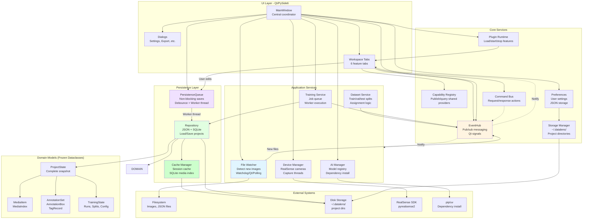
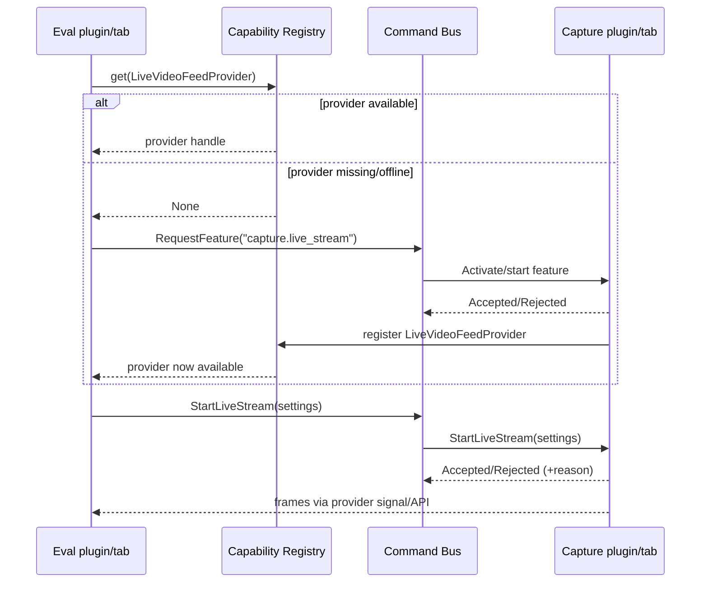

# DataLens Architecture Overview - Implementation Guide

This document provides a high-level architectural overview for understanding and rebuilding DataLens. It focuses on the essential services, their responsibilities, and how they interact.

## Core Architecture Diagram



## Essential Services to Implement

### 1. Event System (EventHub)
**Purpose**: Decoupled communication between components

**Key Features**:
- Publish/subscribe pattern using Qt signals
- Typed event dataclasses
- Per-event channels

**Events to Support**:
- `MediaDiscovered`, `MediaListUpdated`, `MediaRemoved`
- `AnnotationsChanged`, `IsolationChanged`
- `TrainingSplitsChanged`, `TrainingRunQueued`, `TrainingRunCompleted`
- `ModelStateChanged`

**Implementation**:
```python
class EventHub(QObject):
    def channel(self, event_type: Type[T]) -> EventChannel[T]:
        # Return signal wrapper for event type
        
    def publish(self, event: Any) -> None:
        # Emit signal for event type
```

### 2. Plugin Interoperability (Capabilities + Commands)
**Purpose**: Let plugins/tabs share data and request actions without importing each other.

**Concepts**:
- **Capability Registry**: Plugins register optional providers (e.g., a `LiveVideoFeedProvider`) under a stable interface/key; consumers query at runtime and handle `None` when the provider/plugin is not available.
- **Command Bus**: Plugins send typed requests (e.g., “start webcam stream with these settings”) and get an explicit accept/reject response. The runtime can decide whether to start/activate the providing plugin, or reject the request if the feature is disabled.
- **EventHub**: Used for coarse-grained broadcast updates (availability/state changes). Avoid pushing high-rate streams (video frames) through the global bus.

**Example flow (Eval requests Capture)**:
1. Eval queries `CapabilityRegistry` for `LiveVideoFeedProvider`; if missing, it can prompt to enable Capture (or stay read-only).
2. Eval sends `StartLiveStream` via `CommandBus` (with desired settings).
3. Capture accepts/rejects; if accepted it starts streaming and exposes frames via the provider API/signal.



### 3. Persistence Queue (Non-Blocking Saves)
**Purpose**: Save data without blocking UI

**Key Features**:
- Debounce timer (250ms) to coalesce rapid edits
- Three-phase pipeline:
  1. `merge_func`: Update cache (GUI thread)
  2. `snapshot_func`: Create immutable copy (GUI thread)
  3. `save_func`: Write to disk (worker thread)
- ThreadPoolExecutor with 1 worker
- Completion signals

**Implementation**:
```python
class PersistenceQueue(QObject):
    jobFinished = Signal(object)
    jobFailed = Signal(object, object)
    
    def enqueue(self, keys, payload, immediate=False):
        # Queue changes, start/restart debounce timer
        
    def flush(self):
        # Force immediate save
```

### 4. Repository (Data Access)
**Purpose**: Load/save project data

**Key Features**:
- JSON serialization for annotations, tags, training data
- SQLite cache for media index (fast loads)
- Path normalization (relative vs absolute)
- Migration support for legacy formats

**Files**:
- `annotations.json` - Bounding boxes
- `annotation_tags.json` - Class definitions
- `training_splits.json` - Dataset splits
- `training_runs.json` - Training history
- `_media_index.sqlite` - Media cache

**Implementation**:
```python
class JsonProjectRepository:
    def load_state(self, directory, media) -> ProjectState:
        # Check SQLite cache first (fast)
        # Fall back to filesystem scan (slow, populate cache)
        
    def save_state(self, directory, state):
        # Write JSON files
        # Update SQLite cache
```

### 5. File Watcher (Media Discovery)
**Purpose**: Detect new images in project directory

**Key Features**:
- Three backends (priority order):
  1. Watchdog (real-time, requires package)
  2. Qt QFileSystemWatcher (fallback)
  3. QTimer polling (last resort, 5s interval)
- Thread-safe event marshaling
- Publishes `MediaDiscovered` events

**Implementation**:
```python
class ProjectFileWatcher(QObject):
    def start_watching(self, directory):
        # Start appropriate backend
        
    def _handle_new_file(self, path):
        # Build MediaItem
        # Publish MediaDiscovered event
```

### 6. Cache Manager (Session Cache)
**Purpose**: In-memory cache for current session

**Key Features**:
- Session-based workspaces
- Persistent vs temporary caches
- Automatic cleanup on project close

**Implementation**:
```python
class ProjectCacheManager:
    def get_session_cache(self, project_dir) -> Path:
        # Return session-specific cache directory
        
    def clear_session(self, session_id):
        # Clean up session cache
```

### 7. Dataset Split Service
**Purpose**: Manage train/val/test splits

**Key Features**:
- Configurable split ratios
- Random assignment with seed
- Manual override support
- Publishes `TrainingSplitsChanged` events

**Implementation**:
```python
class DatasetSplitService:
    def assign_splits(self, media_items, config):
        # Assign each image to a split
        # Publish event
```

### 8. Training Service
**Purpose**: Manage training job queue and execution

**Key Features**:
- Job queue with priority
- Worker thread execution
- Progress reporting
- Cancellation support
- Publishes training lifecycle events

**Implementation**:
```python
class TrainingJobManager:
    def queue_job(self, request):
        # Add to queue
        # Publish TrainingRunQueued
        
class TrainingExecutionService:
    def execute(self, request):
        # Run training in worker thread
        # Publish progress events
```

### 9. AI Model Manager
**Purpose**: Manage AI model registry and dependencies

**Key Features**:
- Model manifest (JSON)
- Dependency bundles per model
- Async dependency installation
- Model selection and favorites

**Implementation**:
```python
class AIModelManager:
    def get_available_models(self) -> List[ModelSpec]:
        # Load from manifest
        
    def install_dependencies(self, model_id):
        # Async pip install in thread
```

### 10. Device Manager (Optional - RealSense)
**Purpose**: Manage RealSense camera capture

**Key Features**:
- Device discovery and enumeration
- Capture worker thread
- Frame streaming
- Device configuration

**Implementation**:
```python
class RealSenseDeviceManager:
    def enumerate_devices(self):
        # Discover connected cameras
        
class RealSenseCaptureThread(QThread):
    def run(self):
        # Capture frames in background
```

## Domain Models (Immutable Dataclasses)

All domain models use `@dataclass(frozen=True)` for immutability and thread safety.

### MediaItem
```python
@dataclass(frozen=True)
class MediaItem:
    path: Path
    checksum: str | None
    added_at: datetime
```

### AnnotationBoxRecord
```python
@dataclass(frozen=True)
class AnnotationBoxRecord:
    x: float  # Normalized 0-1
    y: float  # Normalized 0-1
    width: float  # Normalized 0-1
    height: float  # Normalized 0-1
    tag: str  # Class name
    confidence: float | None = None
    track_id: int | None = None
```

### AnnotationSet
```python
@dataclass(frozen=True)
class AnnotationSet:
    media: MediaItem
    boxes: tuple[AnnotationBoxRecord, ...]
```

### ProjectState
```python
@dataclass(frozen=True)
class ProjectState:
    tags: tuple[TagRecord, ...]
    media: tuple[MediaItem, ...]
    history: ProjectHistory  # Contains annotations
    training: TrainingProjectState
    model: ModelSpecification | None
    current_media_index: int | None
```

## Threading Model

### GUI Thread
- All Qt widgets and UI updates
- Event hub publish/subscribe
- PersistenceQueue merge/snapshot callbacks
- File watcher event handling (marshaled from worker)

### Worker Threads
- PersistenceQueue save callback (ThreadPoolExecutor)
- Training execution (QThread or ThreadPoolExecutor)
- Dependency installation (QThread)
- Device capture (QThread)
- File watcher (Watchdog observer)

### Thread Communication
- Qt signals (thread-safe)
- `QMetaObject.invokeMethod` for cross-thread calls
- Immutable dataclasses for safe data sharing

## Data Flow Patterns

### Save Flow
```
User Edit → Tab updates cache → PersistenceQueue.enqueue()
→ Debounce timer (250ms) → merge_func (GUI thread)
→ snapshot_func (GUI thread) → save_func (worker thread)
→ Write JSON → jobFinished signal → UI update
```

### Load Flow
```
Open Project → Repository.load_state()
→ Check SQLite cache → Cache hit: instant load
→ Cache miss: scan filesystem + populate cache
→ Build ProjectState → Update UI
```

### Media Discovery Flow
```
New file → Watchdog detects → Marshal to GUI thread
→ Build MediaItem → EventHub.publish(MediaDiscovered)
→ Tabs receive event → Update UI
```

## File Structure

### User Storage (~/.datalens/)
```
~/.datalens/
├── preferences.json          # User preferences
├── ui_state.json            # Recent projects, window state
├── logs/
│   ├── datalens.log
│   └── datalens-crash.log
└── models/
    ├── base/                # Base models
    └── published/           # Published models
```

### Project Directory
```
<project>/
├── annotations.json         # Annotation data
├── annotation_tags.json     # Class definitions
├── training_splits.json     # Dataset splits
├── training_runs.json       # Training history
├── _media_index.sqlite      # Media cache (auto-generated)
├── _cache/                  # Session cache (auto-generated)
│   ├── sessions/
│   └── persistent/
└── *.jpg, *.png, ...        # Media files
```

## Key Design Patterns

1. **Event-Driven Architecture**: EventHub for decoupled communication
2. **Repository Pattern**: JsonProjectRepository for data access
3. **Producer-Consumer**: PersistenceQueue with debouncing
4. **Observer Pattern**: File watcher, event subscriptions
5. **Strategy Pattern**: Multiple file watcher backends
6. **Immutable Data**: Frozen dataclasses for thread safety
7. **Template Method**: BaseWorkspaceTab lifecycle

## Performance Optimizations

### 1. Non-Blocking Saves
- Debounce timer coalesces rapid edits
- Worker thread handles disk I/O
- GUI remains responsive

### 2. Fast Project Loads
- SQLite cache avoids filesystem scans
- First load: scan + populate cache
- Subsequent loads: query SQLite (instant)

### 3. Lazy Loading
- Load metadata first
- Load image pixels on-demand
- Thumbnail generation deferred

### 4. Incremental Discovery
- File watcher detects new images
- Add to index incrementally
- UI updates progressively

### 5. Session Cache
- In-memory cache for current session
- Avoids repeated disk reads
- Cleared on project close

## Implementation Checklist

### Phase 1: Core Infrastructure
- [ ] Event system (EventHub, EventChannel)
- [ ] Storage manager (UserStoragePaths)
- [ ] Preferences system (AppPreferences)
- [ ] Logging system (queue-based)

### Phase 2: Persistence
- [ ] PersistenceQueue (non-blocking saves)
- [ ] JsonProjectRepository (load/save)
- [ ] MediaIndexDB (SQLite cache)
- [ ] Cache manager (session cache)

### Phase 3: Services
- [ ] File watcher (Watchdog/Qt/Polling)
- [ ] Dataset split service
- [ ] Training job manager
- [ ] Training execution service
- [ ] AI model manager

### Phase 4: Domain Models
- [ ] Media models (MediaItem, MediaIndex)
- [ ] Annotation models (AnnotationSet, AnnotationBox, TagRecord)
- [ ] Project models (ProjectState, ProjectHistory)
- [ ] Training models (TrainingState, TrainingRun, etc.)

### Phase 5: UI Layer
- [ ] MainWindow (central coordinator)
- [ ] BaseWorkspaceTab (base class)
- [ ] Tab implementations (6 tabs)
- [ ] Dialogs (settings, export, etc.)

### Phase 6: Optional Features
- [ ] Device manager (RealSense)
- [ ] Networking layer (mDNS, WebSocket)
- [ ] Import/export (COCO, YOLO)

## Critical Dependencies

### Required
- **PySide6**: Qt bindings for Python
- **Pillow**: Image loading and processing
- **numpy**: Array operations

### Recommended
- **watchdog**: Real-time file monitoring
- **pyrealsense2**: RealSense camera support (if using Capture tab)
- **zeroconf**: mDNS discovery (if using Cute Teleop tab)

### Optional
- **torch/ultralytics**: AI model inference
- **opencv-python**: Advanced image processing

## Rebuild Strategy

### Minimal Viable Product (MVP)
1. Event system + Preferences
2. Repository (JSON only, no SQLite cache)
3. Single tab (Annotation)
4. Basic save/load (synchronous, blocking)

### Enhanced Version
1. Add PersistenceQueue (non-blocking saves)
2. Add SQLite cache (fast loads)
3. Add File watcher (media discovery)
4. Add more tabs (Review, MEval, Train)

### Full Version
1. Add Training service (job queue)
2. Add AI model manager
3. Add Device manager (RealSense)
4. Add Networking layer (Cute Teleop)
5. Add Import/export

## Testing Strategy

### Unit Tests
- Domain models (serialization, validation)
- Repository (load/save, cache)
- Services (split logic, job queue)

### Integration Tests
- Event flow (publish → subscribe)
- Save flow (edit → queue → disk)
- Load flow (disk → cache → UI)

### Performance Tests
- Large projects (10,000+ images)
- Rapid edits (debounce effectiveness)
- Cache hit rate (SQLite effectiveness)

## Common Pitfalls to Avoid

1. **Blocking the GUI thread**: Always use worker threads for I/O
2. **Forgetting to debounce**: Rapid saves will kill performance
3. **Not using cache**: Scanning 10,000 images on every load is slow
4. **Mutable state**: Use frozen dataclasses for thread safety
5. **Tight coupling**: Use EventHub instead of direct references
6. **Synchronous I/O**: Use PersistenceQueue pattern
7. **No error handling**: File I/O can fail, handle gracefully

## Summary

DataLens is built on a foundation of:
- **Event-driven architecture** for decoupling
- **Non-blocking I/O** for responsiveness
- **Caching strategies** for performance
- **Immutable data** for thread safety
- **Modular services** for maintainability

The key to rebuilding is understanding these patterns and implementing them consistently across all features.
