# AnnotationTab Architecture Analysis

## Overview

The AnnotationTab is the most complex workspace tab in DataLens, serving as the primary interface for image annotation. It coordinates multiple subsystems including media management, annotation storage, AI-assisted detection, undo/redo, keyboard shortcuts, and real-time canvas rendering.

**File**: `src/datalens/ui/tabs/annotation/tab.py` (9,213 lines)

## Component Architecture

### Core Controllers and Managers

The AnnotationTab delegates responsibilities to specialized controllers:

1. **ClassPanelController** (`_class_panel_controller`)
   - Manages the class list UI (tag rows, add/remove operations)
   - Handles class reordering via drag-and-drop
   - Coordinates with tag shortcuts (1-0 keys)

2. **MediaPanelController** (`_media_panel_controller`)
   - Controls the image scroll area and viewport
   - Manages zoom, pan, and view state
   - Handles viewport restoration from saved state

3. **ToolsPanelController** (`_tools_panel_controller`)
   - Manages the floating toolbar UI
   - Coordinates tool button states

4. **DetectionController** (`_detection_controller`)
   - Orchestrates AI model inference
   - Handles detection mode state (prompt vs full-image)
   - Manages deduplication of AI-generated boxes
   - Provides hover preview for detections

5. **Sam2TrackingController** (`_sam2_tracker`)
   - Manages SAM2 video tracking workflow
   - Coordinates frame-to-frame annotation propagation

6. **AIModelManager** (`_ai_manager`)
   - External dependency for model selection and loading
   - Provides model specifications and runtime

7. **DatasetSplitService** (`_dataset_service`)
   - Manages train/val/test split assignments
   - Handles ingest status for images

8. **_UndoRedoManager** (`_undo_manager`)
   - Maintains per-image undo/redo stacks
   - Snapshots annotation state for history

9. **AnnotationStore** (`_annotation_store`)
   - In-memory storage for all annotations (keyed by image path)
   - Provides fast lookup and modification

10. **PersistenceQueue** (`_annotations_changed_queue`)
    - Debounced, non-blocking annotation persistence
    - Merges pending changes before save
    - Emits events when save completes

### State Management

The AnnotationTab maintains extensive state across multiple dimensions:

#### Media State
- `_media_files`: List[Path] - All discovered media paths
- `_media_items`: List[MediaItem] - Media with metadata
- `_media_lookup`: Dict[Path, MediaItem] - Fast path-to-item lookup
- `_media_index`: MediaIndex - Domain model for media collection
- `_media_cache`: OrderedDict[Path, MediaItem] - LRU cache (512 items)
- `_pixmap_cache`: OrderedDict[Path, QPixmap] - Rendered pixmap cache (80 items)
- `_current_index`: int - Currently displayed image index
- `_displayed_media_path`: Optional[Path] - Path of current image
- `_current_pixmap`: Optional[QPixmap] - Rendered current image

#### Annotation State
- `_annotation_store`: AnnotationStore - All boxes for all images
- `_annotation_image_sizes`: Dict[str, QSize] - Image dimensions per annotation key
- `_annotation_path_lookup`: Dict[str, Path] - Key-to-path reverse lookup
- `_tag_records`: List[TagRecord] - Class list (name, color, shortcut)
- `_selected_tag_index`: Optional[int] - Currently selected class
- `_current_tool`: str - Active tool ("select", "box", "ai")

#### View State
- `_isolate_selected`: bool - Isolation mode active
- `_view_default_settings`: Dict - Fade opacity, spotlight strength, label settings
- `_view_hold_active`: Dict[str, bool] - Per-view hold state (fade/spotlight/labels)
- `_view_hold_combos`: Dict[str, Optional[Tuple[int, int]]] - Key combos for holds
- `_view_last_active_states`: Dict[str, bool] - Last active state before hold

#### Shortcut State
- `_tool_shortcut_bindings`: Dict[str, QKeySequence] - Tool shortcuts (V, B, A)
- `_action_shortcut_bindings`: Dict[str, QKeySequence] - Action shortcuts (Ctrl+Z, Delete, etc.)
- `_view_shortcut_bindings`: Dict[str, QKeySequence] - View shortcuts (H, D, L)
- `_view_shortcut_toggle_modes`: Dict[str, bool] - Toggle vs hold mode per view
- `_action_shortcut_toggle_modes`: Dict[str, bool] - Toggle vs hold mode per action
- `_box_select_modifier`: int - Modifier for box selection (default Shift)
- `_ai_menu_modifier`: int - Modifier for AI menu (default Shift)

#### AI State
- `_ai_selected_model_id`: Optional[str] - Currently selected model
- `_ai_loading`: bool - Model loading in progress
- `_ai_detection_active`: bool - Detection mode active
- `_ai_prompt_active`: bool - Prompt mode active
- `_ai_duplicate_detection_enabled`: bool - Deduplicate AI boxes
- `_ai_duplicate_min_similarity`: float - Similarity threshold for deduplication
- `_ai_tracking_prompt_mode`: str - "box" or "centroid" for SAM2
- `_sam2_tracking_mode`: bool - SAM2 tracking enabled

#### Directory Filter State
- `_directory_filter`: Optional[Path] - Active directory filter
- `_directory_filter_key`: Optional[str] - Filter key string
- `_visible_media_indices`: List[int] - Indices after filtering
- `_visible_index_lookup`: Dict[int, int] - Global-to-visible index mapping
- `_directory_child_map`: Dict[str, Set[str]] - Directory hierarchy

#### Flagging State
- `_flagged_paths`: Set[str] - Images marked as flagged
- `_flagged_modes`: Dict[str, str] - Per-image flag mode ("keep" or "unused")
- `_flagged_manifest_present`: bool - Flagged manifest file exists

#### Worker State
- `_scan_thread`: Optional[QThread] - Background media scanner thread
- `_scan_worker`: Optional[_MediaScanWorker] - Scanner worker
- `_discovery_thread`: Optional[QThread] - Discovery worker thread
- `_discovery_worker`: Optional[_MediaDiscoveryWorker] - Discovery worker
- `_io_executor`: ThreadPoolExecutor - I/O operations (2 workers)
- `_decode_executor`: ThreadPoolExecutor - Image decoding (2 workers)

## Event Subscriptions

The AnnotationTab subscribes to the following EventHub events:

1. **MediaDiscovered** - Appends newly discovered media items
2. **MediaRemoved** - Removes media items from the list
3. **TrainingSplitsChanged** - Updates ingest status badges

## Event Publications

The AnnotationTab publishes the following events:

1. **AnnotationsChanged** - When annotations are modified
2. **IsolationChanged** - When isolation mode toggles
3. **PreviousBoxesVisibilityChanged** - When previous boxes overlay changes
4. **ViewModeChanged** - When view modes (fade/spotlight/labels) change
5. **ShortcutModeChanged** - When shortcut modes change

## Keyboard Shortcut System

### Architecture

The shortcut system supports three modes:
1. **Direct action** - Immediate execution (e.g., Ctrl+Z for undo)
2. **Toggle** - Press to toggle state (e.g., I for isolation)
3. **Hold** - Hold to temporarily activate, release to restore (e.g., hold H for fade)

### Implementation Details

**Hold Detection**:
- Uses global event filter to detect key press/release
- Tracks active combos in `_view_hold_combos` and `_action_hold_combos`
- Stores restoration state in `_action_hold_restore_state`
- Skip flags prevent immediate re-trigger after release

**Shortcut Categories**:
1. **Tool shortcuts** - Switch tools (V=select, B=box, A=AI)
2. **Action shortcuts** - Perform actions (Ctrl+Z=undo, Delete=delete, etc.)
3. **View shortcuts** - Toggle overlays (H=fade, D=spotlight, L=labels)
4. **Navigation shortcuts** - Move between images (A/D, Alt+A/Alt+D)

**Modifier Handling**:
- Box select modifier (default Shift) - Multi-select boxes
- AI menu modifier (default Shift) - Open AI options menu

### Default Shortcuts

```python
DEFAULT_TOOL_SHORTCUTS = {
    "select": "V",
    "box": "B",
}

DEFAULT_ACTION_SHORTCUTS = {
    "ai": "A",
    "previous_image": "A",
    "previous_keep": "Alt+A",
    "next_image": "D",
    "next_keep": "Alt+D",
    "next_image_tracked": "Shift+D",
    "undo": "Ctrl+Z",
    "redo": "Ctrl+Y",
    "copy": "Ctrl+C",
    "paste": "Ctrl+V",
    "delete_selection": "Delete",
    "select_all": "Ctrl+A",
    "reset_view": "F",
    "toggle_isolation": "I",
    "toggle_previous_boxes": "P",
    "mark_ingest_ready": "Ctrl+Shift+I",
    "flag_image": "Ctrl+Shift+F",
    "jump_to_start": "Home",
    "jump_to_end": "End",
}

DEFAULT_VIEW_SHORTCUTS = {
    "fade": "H",
    "spotlight": "D",
    "labels": "L",
}
```

## Media Discovery Pipeline

### Two-Phase Discovery

**Phase 1: Fast Discovery** (`_MediaDiscoveryWorker`)
- Walks directory tree, emits batches of 200 items
- Creates MediaItem with path and mtime
- No validation, just file enumeration
- Allows UI to populate quickly

**Phase 2: Validation & Caching** (`_MediaScanWorker`)
- Validates RGB format using OpenCV
- Moves incompatible files to `_incompatible/` directory
- Updates SQLite cache (`MediaIndexDB`)
- Uses directory fingerprinting to skip unchanged directories
- Emits validated batches

### Caching Strategy

**MediaIndexDB** (SQLite):
- Stores: path, mtime, size, rgb_ok, width, height
- Directory fingerprints: mtime + file count + dir count
- Enables incremental scanning (only changed directories)

**In-Memory Caches**:
- Media cache: 512 items (LRU)
- Pixmap cache: 80 items (LRU)
- Prefetch futures: Decode next/previous images

## Annotation Save Logic

### Save Flow

1. **User modifies annotations** → `_schedule_annotations_changed()`
2. **Debounce timer** (250ms) → Merges pending changes
3. **PersistenceQueue** → Snapshots current state
4. **Background save** → Writes JSON to disk
5. **Event emission** → `AnnotationsChanged` event published

### Class List Conflict Resolution

When saving, if the on-disk class list differs from the viewer's class list:

1. **Detection**: `class_lists_match()` compares normalized tags
2. **Dialog**: `ClassListConflictDialog` shows both versions
3. **User choice**: Use viewer classes, use file classes, or cancel
4. **Merge**: Selected class list is used for save

**Implementation**: `src/datalens/ui/tabs/annotation/save.py`

### Merge Logic

The `_merge_boxes_with_similarity()` method:
- Compares new boxes with existing boxes
- Uses IoU (Intersection over Union) similarity
- Optionally requires tag match
- Prevents duplicate boxes from AI detection

## Tool System

### Tool Modes

1. **Select Tool** (`"select"`)
   - Click to select boxes
   - Drag to move boxes
   - Drag handles to resize
   - Shift+drag for multi-select band
   - Hover shows resize handles

2. **Box Tool** (`"box"`)
   - Click and drag to draw new box
   - Assigned to currently selected class
   - Crosshair cursor

3. **AI Tool** (`"ai"`)
   - Click to place prompt point
   - Shift+click for AI options menu
   - Triggers detection via DetectionController

### Tool State Machine

```
[Select] <---> [Box] <---> [AI]
   ^              ^          ^
   |              |          |
   V              B          A
```

Tool transitions:
- Keyboard shortcuts (V, B, A)
- Tool button clicks
- Programmatic `set_tool_mode()`

## Canvas Rendering Pipeline

The AnnotationCanvas (analyzed in subtask 1.2) handles:

1. **Base image rendering** - Scaled pixmap
2. **Box rendering** - All annotation boxes with colors
3. **Overlay rendering**:
   - Fade overlay (dims image)
   - Spotlight overlay (highlights selected box)
   - Label overlay (class names)
   - Previous boxes overlay (dashed boxes from previous image)
4. **Crosshair rendering** - Tool cursor
5. **Selection band rendering** - Multi-select rectangle

### View Modes

- **Fade**: Dims the image (configurable opacity)
- **Spotlight**: Highlights selected box, dims rest
- **Labels**: Shows class names above boxes
- **Previous Boxes**: Shows boxes from previous image (dashed)
- **Isolation**: Hides all boxes except selected

## Integration Points

### With MainWindow
- Signals: `isolationToggled`, `previousBoxesVisibilityChanged`, `viewModeChanged`
- MainWindow updates menu checkboxes to match tab state

### With EventHub
- Subscribes: MediaDiscovered, MediaRemoved, TrainingSplitsChanged
- Publishes: AnnotationsChanged, IsolationChanged, ViewModeChanged, etc.

### With AIModelManager
- Listens: `selectionChanged`, `dependenciesChanged`
- Calls: `selected_model_id()`, `selected_model_specification()`, `select_model()`

### With DatasetSplitService
- Calls: `set_ingest_status()`, `set_ingest_status_many()`, `training_state()`
- Updates ingest status badges based on split assignments

### With PersistenceQueue
- Debounced annotation saves
- Non-blocking background writes
- Merge function for pending changes

## Complexity Metrics

- **Lines of Code**: 9,213
- **Class Count**: 6 (AnnotationTab + 5 helper classes)
- **Method Count**: ~150 public/private methods
- **State Variables**: ~100+ instance variables
- **Dependencies**: 15+ external modules
- **Controllers**: 5 specialized controllers
- **Event Subscriptions**: 3
- **Event Publications**: 5+

## Identified Complexity Hotspots

1. **Shortcut System** - Complex hold/toggle/direct action logic with global event filtering
2. **Media Discovery** - Two-phase pipeline with caching and validation
3. **State Management** - 100+ instance variables tracking various subsystems
4. **Navigation Hold** - Separate timer-based system for hold-to-advance
5. **View Hold System** - Per-view hold state with restoration logic
6. **Directory Filtering** - Complex visible index mapping and tree management

## Simplification Opportunities

1. **Extract Shortcut Manager** - Consolidate shortcut logic into dedicated manager
2. **Extract Media Manager** - Consolidate media discovery, caching, and navigation
3. **Reduce State Variables** - Group related state into dataclasses
4. **Simplify Hold Logic** - Unify action holds and view holds into single system
5. **Extract Navigation Manager** - Consolidate navigation, hold-to-advance, and index management

## Component Diagram

```mermaid
graph TB
    subgraph AnnotationTab
        AT[AnnotationTab Controller]
        
        subgraph Controllers
            CPC[ClassPanelController]
            MPC[MediaPanelController]
            TPC[ToolsPanelController]
            DC[DetectionController]
            STC[Sam2TrackingController]
        end
        
        subgraph Managers
            URM[UndoRedoManager]
            AS[AnnotationStore]
            PQ[PersistenceQueue]
        end
        
        subgraph Workers
            MSW[MediaScanWorker]
            MDW[MediaDiscoveryWorker]
            AIMLW[AIModelLoadWorker]
        end
        
        subgraph UI
            AC[AnnotationCanvas]
            TL[Tag List]
            DT[Directory Tree]
            NB[Navigation Buttons]
        end
        
        AT --> CPC
        AT --> MPC
        AT --> TPC
        AT --> DC
        AT --> STC
        AT --> URM
        AT --> AS
        AT --> PQ
        AT --> MSW
        AT --> MDW
        AT --> AIMLW
        AT --> AC
        AT --> TL
        AT --> DT
        AT --> NB
        
        DC --> AIM[AIModelManager]
        AT --> DSS[DatasetSplitService]
        AT --> EH[EventHub]
        PQ --> FS[FileSystem]
        MSW --> MDB[MediaIndexDB]
    end
    
    EH --> MW[MainWindow]
    AIM --> ML[Model Loader]
```



## Files Analyzed

- `src/datalens/ui/tabs/annotation/tab.py` (9,213 lines)
- `src/datalens/ui/widgets/annotation_canvas.py` (partial)
- `src/datalens/ui/tabs/annotation/save.py` (77 lines)
- `src/datalens/ui/tabs/annotation/class_panel.py` (referenced)
- `src/datalens/ui/tabs/annotation/detection_controller.py` (referenced)
- `src/datalens/ui/tabs/annotation/media_panel.py` (referenced)
- `src/datalens/ui/tabs/annotation/tools_panel.py` (referenced)
- `src/datalens/ui/tabs/annotation/tracking/sam2_tracking.py` (referenced)
- `src/datalens/ui/tabs/annotation/undo.py` (referenced)
- `src/datalens/ui/tabs/annotation/annotation_store.py` (referenced)
- `src/datalens/ui/tabs/annotation/workers.py` (referenced)
