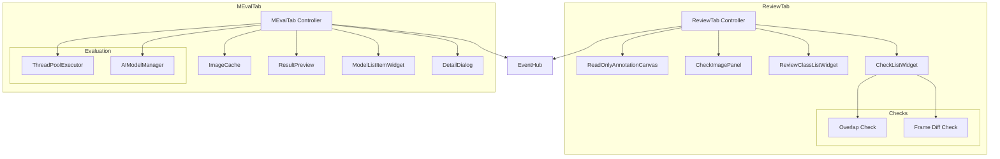

# ReviewTab and MEvalTab Architecture Analysis

## ReviewTab Overview

The ReviewTab provides a read-only annotation review interface with automated quality checks for overlapping boxes and frame-to-frame differences.

**File**: `src/datalens/ui/tabs/review/view.py` (1,474 lines)

### Core Architecture

#### Components

1. **_ReadOnlyAnnotationCanvas**
   - Extends AnnotationCanvas but blocks editing interactions
   - Renders flagged box indicators (red exclamation marks)
   - Renders frame difference overlays (orange dashed boxes)
   - Ignores mouse press/move/release for left button
   - Ignores delete/backspace keys

2. **_CheckImagePanel**
   - Collapsible panel showing check visualizations
   - Displays overlap maps and difference maps
   - Size presets: Compact (220px), Comfortable (280px), Large (360px), Extra large (440px)
   - Composites overlays onto base image

3. **ReviewClassListWidget**
   - Displays class list with statistics
   - Shows box counts per class
   - Allows class filtering

4. **CheckListWidget**
   - Container for quality check widgets
   - Manages check status (checking, pass, warning, error)
   - Provides expandable controls per check

#### State Management

**Media State**:
- `_media_files`: List[Path] - All media paths
- `_media_items`: List[MediaItem] - Media with metadata
- `_media_lookup`: Dict[Path, MediaItem] - Path-to-item lookup
- `_current_index`: int - Currently displayed image
- `_displayed_media_path`: Optional[Path] - Current image path
- `_current_pixmap`: Optional[QPixmap] - Rendered current image

**Annotation State**:
- `_annotation_store`: Dict[str, List[AnnotationBoxRecord]] - All annotations
- `_current_boxes`: List[AnnotationBoxRecord] - Boxes for current image
- `_tag_records`: List[TagRecord] - Class list

**Check State**:
- `_overlap_similarity`: float - Overlap detection threshold (default 0.95)
- `_frame_diff_location_threshold`: float - Location similarity (default 0.6)
- `_frame_diff_difference_threshold`: float - Pixel change tolerance (default 0.12)
- `_image_cache`: Dict[str, QImage] - Cached images for checks

**View State**:
- `_scale_factor`: float - Current zoom level
- `_fit_scale`: float - Fit-to-window scale
- `_zoom_mode_manual`: bool - Manual zoom active
- `_min_zoom_ratio`: float - Minimum zoom (0.2x)
- `_max_zoom_ratio`: float - Maximum zoom (8.0x)

### Quality Checks

#### 1. Overlapping Boxes Check

**Purpose**: Detect duplicate or highly overlapping annotations

**Algorithm**:
```python
def detect_overlapping_boxes(boxes, threshold):
    clusters = []
    for i, box1 in enumerate(boxes):
        for j, box2 in enumerate(boxes[i+1:]):
            iou = calculate_iou(box1, box2)
            if iou >= threshold:
                clusters.append((i, j+i+1, iou))
    return clusters
```

**Visualization**:
- Overlap map shows all boxes with overlaps highlighted
- Red exclamation mark badges on flagged boxes
- Adjustable similarity slider (0-100%)

#### 2. Frame Difference Check

**Purpose**: Find annotations from previous frame that don't match current frame

**Algorithm**:
```python
def find_potential_missed_annotations(
    prev_boxes, curr_boxes, prev_image, curr_image,
    location_threshold, difference_threshold
):
    missed = []
    for prev_box in prev_boxes:
        # Find best matching current box by location
        best_match = find_best_location_match(prev_box, curr_boxes)
        if best_match and iou(prev_box, best_match) >= location_threshold:
            # Check if pixels changed significantly
            diff = calculate_pixel_difference(
                prev_image, curr_image, prev_box
            )
            if diff <= difference_threshold:
                # Box location matches but pixels didn't change much
                continue
        missed.append(prev_box)
    return missed
```

**Visualization**:
- Difference map shows pixel changes between frames
- Orange dashed boxes show previous frame annotations
- Adjustable location similarity slider
- Adjustable pixel change tolerance slider

### Navigation

**Shortcuts**:
- Left Arrow: Previous image
- Right Arrow: Next image
- F: Reset view to fit

**Hold-to-Advance**:
- Hold navigation keys to continuously advance
- Configurable delay (default 600ms) and interval (default 500ms)

### Integration Points

**With EventHub**:
- Subscribes: MediaDiscovered, MediaRemoved
- No publications (read-only tab)

**With AnnotationCanvas**:
- Extends canvas for rendering
- Blocks editing interactions
- Adds custom overlays for checks

### Complexity Metrics

- **Lines of Code**: 1,474
- **Class Count**: 4 (ReviewTab + 3 helper classes)
- **Method Count**: ~40
- **State Variables**: ~30
- **Quality Checks**: 2 (overlap, frame diff)

---

## MEvalTab Overview

The MEvalTab (Model Evaluation Tab) provides side-by-side comparison of multiple AI model predictions on the same images.

**File**: `src/datalens/ui/tabs/meval/view.py` (1,800+ lines)

### Core Architecture

#### Components

1. **_ImageCache**
   - LRU cache for PIL images (default 12 images)
   - Thread-safe with locking
   - Lazy loading from disk

2. **_BadgeButton**
   - Floating badge showing model label
   - Clickable to open detail dialog
   - Styled with model color and opacity

3. **_ResultPreview**
   - Preview cell for one model's predictions
   - Contains OverlayImageView for rendering
   - Badge button for model identification
   - Click to open detail dialog

4. **_ModelListItemWidget**
   - List item showing model configuration
   - Checkbox for selection
   - Memory requirements display (RAM/VRAM)
   - Progress bar for loading status
   - Remove button

5. **_DetailDialog**
   - Full-screen view of single model predictions
   - Confidence slider
   - Class list with confidence values
   - Zoomable image view

6. **OverlayImageView**
   - Zoomable, pannable image viewer
   - Renders bounding boxes with labels
   - Supports confidence filtering

#### State Management

**Media State**:
- `_media_items`: List[MediaItem] - All media
- `_media_index`: MediaIndex - Current index tracking
- `_image_cache`: _ImageCache - PIL image cache
- `_project_directory`: Optional[Path] - Project root

**Model State**:
- `_model_entries`: List[EvaluationModelConfig] - Available models
- `_model_row_widgets`: Dict[str, _ModelListItemWidget] - UI widgets per model
- `_load_all_selected`: bool - Load mode (individual vs all)
- `_override_enabled`: bool - Override memory limits

**Results State**:
- `_rendered_results`: Dict[Path, List[_RenderedResult]] - Rendered predictions per image
- `_results_index`: Dict[Path, Dict[str, EvaluationResult]] - Raw results lookup
- `_preview_lookup`: Dict[str, _ResultPreview] - Model ID to preview widget
- `_class_colors`: Dict[str, QColor] - Class name to color mapping

**UI State**:
- `_confidence_threshold`: float - Confidence filter (default 0.25)
- `_box_style`: BoxStyle - Box rendering style (width, dash pattern, etc.)
- `_splitter_state`: Dict[Path, dict] - Per-image splitter sizes
- `_splitter_defaults`: Dict[Path, dict] - Default splitter sizes

**Execution State**:
- `_cancel_flag`: threading.Event - Cancellation signal
- `_executor`: ThreadPoolExecutor - Background evaluation (1 worker)
- `_active_future`: Optional[Future] - Current evaluation task

### Evaluation Workflow

#### 1. Model Selection

User selects models from dropdown and adds to list:
- Each model shows memory requirements
- Checkbox to include in evaluation
- Remove button to delete from list

#### 2. Load Mode

**Individual Mode** (default):
- Load one model at a time
- Run inference
- Unload model
- Repeat for next model
- Lower memory usage, slower

**Load All Mode**:
- Load all selected models into memory
- Run inference on all models
- Faster, but requires more memory
- Memory check with override option

#### 3. Evaluation Execution

```python
def _run_evaluation_background(models, image_path):
    results = []
    for model in models:
        if cancel_requested:
            break
        
        # Load model if needed
        if not model.loaded:
            load_model(model)
            emit_progress(model.id, 50.0)
        
        # Run inference
        predictions = model.predict(image_path)
        emit_progress(model.id, 100.0)
        
        # Store result
        results.append(EvaluationResult(
            model_id=model.id,
            model_label=model.label,
            predictions=predictions
        ))
    
    return results
```

#### 4. Result Rendering

For each model result:
1. Load base image from cache
2. Scale predictions to match display size
3. Draw bounding boxes with labels
4. Apply confidence threshold
5. Create pixmap
6. Display in grid cell

### Grid Layout

**2-Column Grid**:
- Dynamically creates rows as needed
- Each cell is a `_ResultPreview`
- Splitters between rows for resizing
- Splitter state saved per image

**Splitter Management**:
- Default state: equal heights
- User adjustments saved per image
- Reset layout shortcut (Ctrl+F)

### Box Style Customization

Users can customize box rendering:
- Line width (1-10px)
- Line style (solid, dashed, dotted)
- Dash length (for dashed style)
- Dash gap (for dashed style)

### Shortcuts

**Default Shortcuts**:
- F: Reset view (zoom to fit)
- Ctrl+F: Reset layout (restore default splitter sizes)

**Shortcut Behavior**:
- F resets the preview under cursor
- If no preview under cursor, resets all previews

### Export Functionality

**Export Annotated Images**:
- Exports predictions as annotated images
- One folder per model
- Applies current confidence threshold
- Preserves original image dimensions

### Integration Points

**With AIModelManager**:
- Loads model specifications
- Triggers model loading
- Runs inference

**With ProjectCacheManager**:
- Caches evaluation results
- Persists results across sessions

**With EventHub**:
- Publishes: evaluationStarted, evaluationFinished
- No subscriptions

### Complexity Metrics

- **Lines of Code**: 1,800+
- **Class Count**: 7 (MEvalTab + 6 helper classes)
- **Method Count**: ~60
- **State Variables**: ~40
- **Background Workers**: 1 (evaluation executor)

### Identified Complexity

1. **Grid Management** - Dynamic row/column creation with splitters
2. **Splitter State** - Per-image splitter size persistence
3. **Load Modes** - Two different model loading strategies
4. **Memory Management** - RAM/VRAM estimation and checking
5. **Result Caching** - Multi-level caching (images, results, pixmaps)

---

## Comparison: ReviewTab vs MEvalTab

| Aspect | ReviewTab | MEvalTab |
|--------|-----------|----------|
| **Purpose** | Quality assurance | Model comparison |
| **Interaction** | Read-only | Read-only |
| **Primary Feature** | Automated checks | Side-by-side predictions |
| **Complexity** | Medium | High |
| **Background Work** | None | Model loading & inference |
| **Caching** | Image cache | Image + result cache |
| **Grid Layout** | Single image | Multi-model grid |
| **Customization** | Check thresholds | Box style, confidence |

## Component Diagram



## Files Analyzed

### ReviewTab
- `src/datalens/ui/tabs/review/view.py` (1,474 lines)
- `src/datalens/ui/tabs/review/class_list.py` (referenced)
- `src/datalens/ui/tabs/review/checks/__init__.py` (referenced)
- `src/datalens/ui/tabs/review/checks/overlap.py` (referenced)
- `src/datalens/ui/tabs/review/checks/frame_diff.py` (referenced)
- `src/datalens/ui/tabs/review/checks_list.py` (referenced)

### MEvalTab
- `src/datalens/ui/tabs/meval/view.py` (1,800+ lines)
- `src/datalens/ui/tabs/meval/models.py` (referenced)
- `src/datalens/ui/widgets/overlay_image_view.py` (referenced)
