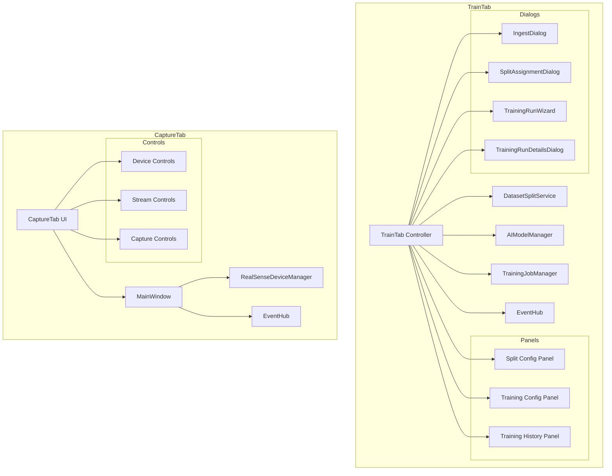

# TrainTab and CaptureTab Architecture Analysis

## TrainTab Overview

The TrainTab provides a comprehensive interface for managing dataset splits, configuring training runs, and monitoring training job execution.

**File**: `src/datalens/ui/tabs/train/tab.py` (1,200+ lines)

### Core Architecture

#### External Dependencies

1. **DatasetSplitService** (`_dataset_service`)
   - Manages train/val/test split configuration
   - Handles image-to-split assignments
   - Persists split state and assignments
   - Provides preprocessing and augmentation configs

2. **AIModelManager** (`_ai_manager`)
   - Provides model specifications for training
   - Lists available models and their requirements

3. **TrainingJobManager** (`_training_manager`)
   - Manages training job queue
   - Tracks job status (queued, running, completed, failed)
   - Provides job cancellation and deletion

#### State Management

**Split Configuration State**:
- `_dataset_split_config`: Optional[DatasetSplitConfig] - Current split configuration
- `_split_assignments`: Tuple[ImageSplitAssignment, ...] - Image-to-split assignments
- `_manual_counts`: Dict[str, int] - Manual assignment counts per split
- `_default_split_template`: Sequence[tuple[str, float]] - Default split ratios

**Training State**:
- `_epoch_count`: int - Epochs per training run
- `_project_directory`: Optional[Path] - Project root directory
- `_run_states`: Dict[str, dict] - Per-run state tracking
- `_default_epochs_per_run`: int - Default epoch count

**UI State**:
- `_theme`: AppTheme - Theme for styling
- `_split_overview`: Widget showing split statistics
- `_run_panel`: Widget for configuring and starting runs
- `_history_panel`: Widget showing past training runs

### UI Components

#### 1. Split Configuration Panel

**Split Overview Widget**:
- Shows split names and percentages
- Displays assigned/unassigned image counts
- Interactive editing of split ratios
- Visual progress bars for each split

**Split Actions**:
- **Ingest Button**: Opens IngestDialog to configure splits
- **Assignment Button**: Opens SplitAssignmentDialog to manually assign images
- **Reset Button**: Clears all assignments

#### 2. Training Configuration Panel

**Model Selection**:
- Dropdown to select model for training
- Shows model requirements (RAM, VRAM)
- Validates model availability

**Training Parameters**:
- Epochs per run (spinner)
- Preprocessing configuration
- Augmentation configuration
- Export format selection

**Actions**:
- **Start Training**: Launches TrainingRunWizard
- **Export Dataset**: Exports split datasets to disk

#### 3. Training History Panel

**Run List**:
- Table showing all training runs
- Columns: Status, Model, Epochs, Start Time, Duration, Actions
- Status indicators: Queued, Running, Completed, Failed, Cancelled

**Run Actions**:
- View details (opens TrainingRunDetailsDialog)
- Cancel running job
- Delete completed job
- Export trained model

### Training Workflow

#### 1. Split Configuration

```
User clicks "Ingest" 
  → IngestDialog opens
  → User configures splits (train 70%, val 20%, test 10%)
  → User assigns images (auto or manual)
  → DatasetSplitService persists configuration
  → TrainTab refreshes split overview
```

#### 2. Training Execution

```
User clicks "Start Training"
  → TrainingRunWizard opens
  → User selects model
  → User configures hyperparameters
  → User clicks "Start"
  → TrainingJobManager queues job
  → TrainingExecutionService picks up job
  → Worker backend executes training
  → Progress events update UI
  → Completion event updates history
```

#### 3. Dataset Export

```
User clicks "Export Dataset"
  → ExportDatasetDialog opens
  → User selects format (YOLO, COCO, etc.)
  → User selects output directory
  → Exporter writes split datasets to disk
  → Success notification shown
```

### Event Subscriptions

The TrainTab subscribes to:

1. **TrainingJobQueued** - New job added to queue
2. **TrainingJobStarted** - Job execution began
3. **TrainingJobProgress** - Progress update (epoch, loss, etc.)
4. **TrainingJobCompleted** - Job finished successfully
5. **TrainingJobFailed** - Job failed with error
6. **TrainingJobCancelled** - Job was cancelled

### Integration Points

**With DatasetSplitService**:
- `training_state()` - Get current split configuration
- `dataset_split_config()` - Get split configuration
- `assignments()` - Get image assignments
- `update_dataset_split()` - Update split configuration
- `set_preprocessing_config()` - Set preprocessing
- `set_augmentation_config()` - Set augmentation
- `reset_assignments()` - Clear all assignments

**With TrainingJobManager**:
- `queue_job()` - Add job to queue
- `cancel_job()` - Cancel running job
- `delete_job()` - Remove job from history
- `get_job_status()` - Query job state

**With AIModelManager**:
- `model_specification()` - Get model details
- `list_models()` - Get available models

### Dialogs

1. **IngestDialog**
   - Configure split ratios
   - Auto-assign images to splits
   - Preview split distribution

2. **SplitAssignmentDialog**
   - Manually assign images to splits
   - Bulk assignment operations
   - Filter by directory

3. **TrainingRunWizard**
   - Multi-step wizard for training configuration
   - Model selection
   - Hyperparameter tuning
   - Preprocessing/augmentation setup

4. **TrainingRunDetailsDialog**
   - View training metrics
   - Loss curves
   - Validation metrics
   - Export trained model

### Complexity Metrics

- **Lines of Code**: 1,200+
- **Class Count**: 1 (TrainTab)
- **Method Count**: ~50
- **State Variables**: ~20
- **External Dependencies**: 3 (DatasetSplitService, AIModelManager, TrainingJobManager)
- **Event Subscriptions**: 6

---

## CaptureTab Overview

The CaptureTab provides a simple interface for capturing images from Intel RealSense cameras.

**File**: `src/datalens/ui/tabs/capture.py` (200 lines)

### Core Architecture

#### External Dependencies

1. **MainWindow Controller** (`_controller`)
   - Delegates all capture logic to MainWindow
   - CaptureTab is primarily a UI shell

2. **RealSenseDeviceManager** (`device_manager`)
   - Manages RealSense device discovery
   - Handles device configuration
   - Provides stream control

### UI Components

#### 1. Device Selection

**Device Dropdown**:
- Lists available RealSense cameras
- Shows device serial numbers
- Auto-selects first device

**Device Actions**:
- Refresh device list
- Select active device

#### 2. Stream Configuration

**Stream Options**:
- Resolution selection (640x480, 1280x720, 1920x1080)
- Frame rate selection (15, 30, 60 FPS)
- Stream type (Color, Depth, Infrared)

**Stream Controls**:
- **Start Button**: Begin streaming
- **Stop Button**: End streaming
- **Live Preview**: Shows camera feed

#### 3. Capture Configuration

**Directory Selection**:
- Text field for capture directory
- Browse button to select folder
- Default: `./captures`

**Capture Actions**:
- **Save Image Button**: Capture current frame
- **Space Bar Shortcut**: Quick capture

#### 4. Options Panel

**Capture Options**:
- Auto-increment filename
- Timestamp in filename
- Image format (PNG, JPEG)
- JPEG quality slider

### Capture Workflow

```
User selects device
  → User clicks "Start"
  → RealSenseDeviceManager starts stream
  → Live preview shows camera feed
  → User presses Space or clicks "Save Image"
  → Current frame saved to disk
  → Filename auto-incremented
  → MediaDiscovered event published
```

### Integration Points

**With MainWindow**:
- `_start_streaming()` - Start camera stream
- `_stop_streaming()` - Stop camera stream
- `_capture_image()` - Save current frame
- `_on_device_selected()` - Handle device change
- `_on_capture_directory_changed()` - Handle directory change

**With RealSenseDeviceManager**:
- `enumerate_devices()` - List available cameras
- `start_pipeline()` - Begin streaming
- `stop_pipeline()` - End streaming
- `get_frame()` - Retrieve current frame

**With EventHub**:
- Publishes: MediaDiscovered (when image captured)

### Shortcuts

- **Space**: Capture image (when streaming)

### Complexity Metrics

- **Lines of Code**: 200
- **Class Count**: 1 (CaptureTab)
- **Method Count**: ~10
- **State Variables**: ~5
- **External Dependencies**: 2 (MainWindow, RealSenseDeviceManager)

### Design Notes

The CaptureTab is intentionally minimal - it's primarily a UI shell that delegates all logic to MainWindow and RealSenseDeviceManager. This keeps the tab simple but creates tight coupling to MainWindow.

**Simplification Opportunity**: Extract capture logic from MainWindow into a dedicated CaptureController that CaptureTab can own directly.

---

## Comparison: TrainTab vs CaptureTab

| Aspect | TrainTab | CaptureTab |
|--------|----------|------------|
| **Complexity** | High | Low |
| **Lines of Code** | 1,200+ | 200 |
| **External Dependencies** | 3 services | 2 (MainWindow, DeviceManager) |
| **State Management** | Complex (splits, runs, config) | Minimal (device, directory) |
| **Background Work** | Training jobs | None (streaming in MainWindow) |
| **Dialogs** | 4 complex dialogs | None |
| **Event Subscriptions** | 6 training events | None |
| **Primary Function** | Training orchestration | Camera capture |

## Component Diagram



## Files Analyzed

### TrainTab
- `src/datalens/ui/tabs/train/tab.py` (1,200+ lines)
- `src/datalens/ui/tabs/train/dialogs.py` (referenced)
- `src/datalens/ui/tabs/train/widgets.py` (referenced)
- `src/datalens/ui/tabs/train/preview.py` (referenced)
- `src/datalens/services/dataset_split_service.py` (referenced)
- `src/datalens/services/training/job_manager.py` (referenced)

### CaptureTab
- `src/datalens/ui/tabs/capture.py` (200 lines)
- `src/datalens/device_manager.py` (referenced)
- `src/datalens/capture_thread.py` (referenced)
