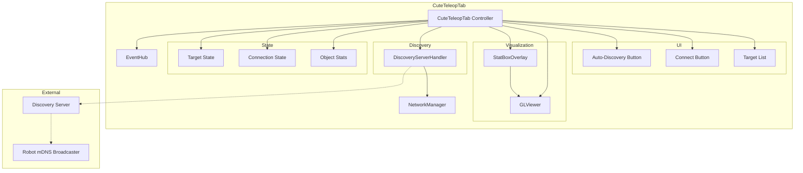

# CuteTeleopTab Architecture Analysis

## Overview

The CuteTeleopTab provides a teleoperation interface for CUTE robots, featuring a 3D visualization of robot state, target management, and WebSocket-based communication with robot discovery.

**File**: `src/datalens/ui/tabs/cute/teleop/teleop.py` (900+ lines)

## Core Architecture

### Components

1. **GLViewer** (`_viewer`)
   - 3D OpenGL viewer for robot visualization
   - Renders robot models, objects, and coordinate frames
   - Supports orthographic and perspective projection
   - Camera controls (pan, zoom, rotate)
   - Object selection and highlighting

2. **StatBoxOverlay** (`_stat_overlay`)
   - Floating overlay showing object statistics
   - Displays position, rotation, velocity, etc.
   - Configurable fields and formatting
   - Auto-positioning (top, bottom, left, right edges)
   - Width policies (auto, fixed, locked)

3. **DiscoveryServerHandler** (`_discovery_server_handler`)
   - Manages mDNS-based robot discovery
   - Connects to discovery server
   - Receives robot announcements
   - Handles connection lifecycle

4. **Target List** (`_target_list`)
   - QListWidget showing discovered/manual targets
   - Stores target metadata (IP, port, capabilities)
   - Selection triggers visualization update
   - Double-click to connect

### State Management

**Target State**:
- `_connections_by_name`: Dict[str, object] - Active WebSocket connections per target
- `_visualization_target`: Optional[str] - Currently visualized target
- `_auto_discovery_enabled`: bool - Auto-discovery toggle state

**Viewer State**:
- `_object_stats`: Dict[str, Dict[str, object]] - Per-object statistics
- `_statbox_labels`: Dict[str, str] - Display labels for objects
- `_statbox_fields`: List[str] - Fields to show in stat boxes
- `_statbox_width_policy`: StatboxWidthPolicy - Width calculation mode

**Network State**:
- `_network_manager`: Optional[object] - Network manager instance
- `_discovery_server_handler`: DiscoveryServerHandler - Discovery handler

**Configuration**:
- `USE_ASYNC_LOAD`: bool - Use async scene loading (default False)
- `_theme`: AppTheme - UI theme

## Target Management

### Adding Targets

**Manual Addition**:
```python
tab.add_target("Robot-1", {
    "ip": "192.168.1.100",
    "port": 8080,
    "type": "follower"
})
```

**Auto-Discovery**:
```
Discovery server announces robot
  → DiscoveryServerHandler receives announcement
  → Handler calls add_target() with robot info
  → Target appears in list
```

### Target Selection

When user selects a target:
1. `_on_target_selected()` called
2. `_visualization_target` updated
3. `visualizationTargetChanged` signal emitted
4. Subscribers can update visualization

### Target Connection

When user double-clicks or clicks "Connect":
1. `_on_connect_clicked()` called
2. WebSocket connection established
3. Connection stored in `_connections_by_name`
4. Telemetry streaming begins

## 3D Visualization

### Scene Loading

**Synchronous Loading** (default):
```python
num_objects = viewer.load_scene_from_json_sync(json_path)
_on_model_loaded(num_objects)
```

**Asynchronous Loading** (optional):
```python
viewer.sceneLoadedAsync.connect(_on_model_loaded)
viewer.load_scene_from_json_async(json_path)
# _on_model_loaded() called when complete
```

### Object Management

**Adding Objects**:
```python
# Add cube
tab.add_cube("gripper", size=0.05, color=(1, 0, 0))

# Add from scene JSON
viewer.load_scene_from_json_sync("robot_model.json")
```

**Updating Objects**:
```python
# Update position
tab.set_object_translation("gripper", (0.5, 0.2, 0.1))

# Update rotation
tab.set_object_rotation("gripper", (0, 0, 45))

# Select/highlight
tab.set_object_selected("gripper", selected=True)
```

**Removing Objects**:
```python
tab.remove_object("gripper")
```

### StatBox Overlay

**Purpose**: Display real-time statistics for 3D objects

**Configuration**:
```python
# Set fields to display
tab.update_statbox_fields(["position", "rotation", "velocity"])

# Lock to edge
tab.lock_statboxes_to_edge("top")

# Set width policy
tab.set_statbox_width_policy("auto")  # or "fixed", "locked"
```

**Content Factory**:
```python
def _build_statbox_content(obj_name: str) -> List[Tuple[str, str]]:
    stats = _object_stats.get(obj_name, {})
    return [
        ("Position", f"({stats['x']:.2f}, {stats['y']:.2f}, {stats['z']:.2f})"),
        ("Rotation", f"{stats['rotation']:.1f}°"),
    ]
```

**Content Updater**:
```python
def _update_statbox_content(
    obj_name: str, 
    existing: List[Tuple[str, str]]
) -> List[Tuple[str, str]]:
    # Update only changed fields
    stats = _object_stats.get(obj_name, {})
    existing[0] = ("Position", f"({stats['x']:.2f}, {stats['y']:.2f}, {stats['z']:.2f})")
    return existing
```

## Discovery System

### Architecture

**Components**:
1. **mDNS Broadcaster** (on robot) - Announces robot presence
2. **Discovery Server** (optional) - Aggregates announcements
3. **DiscoveryServerHandler** (in tab) - Receives announcements

### Discovery Flow

```
Robot starts
  → mDNS broadcaster announces service
  → Discovery server receives announcement
  → Discovery server forwards to connected clients
  → DiscoveryServerHandler receives announcement
  → Handler parses robot info
  → Handler calls add_target()
  → Target appears in list
```

### Auto-Discovery Toggle

**Enable**:
```python
_autodiscovery_enabled()
  → Connect to discovery server
  → Start receiving announcements
  → Auto-add targets as discovered
```

**Disable**:
```python
_autodiscovery_disabled()
  → Disconnect from discovery server
  → Stop receiving announcements
  → Manual target management only
```

## Integration Points

### With EventHub
- Inherits from BaseWorkspaceTab
- Can publish/subscribe to events
- Currently no specific event subscriptions

### With NetworkManager
- Manages WebSocket connections
- Handles connection lifecycle
- Provides connection status

### With GLViewer
- Renders 3D scene
- Handles user interaction (pan, zoom, rotate)
- Emits selection events

### With DiscoveryServerHandler
- Manages discovery server connection
- Receives robot announcements
- Handles reconnection logic

## Signals

1. **visualizationTargetChanged(str, object)**
   - Emitted when visualization target changes
   - Parameters: target label, target metadata

## Preferences

The tab responds to preference changes:
- Discovery server address
- Discovery server port
- Auto-discovery enabled/disabled
- Viewer settings (projection, camera)

## Complexity Metrics

- **Lines of Code**: 900+
- **Class Count**: 1 (CuteTeleopTab)
- **Method Count**: ~40
- **State Variables**: ~15
- **External Dependencies**: 4 (GLViewer, StatBoxOverlay, DiscoveryServerHandler, NetworkManager)
- **Signals**: 1 (visualizationTargetChanged)

## Identified Complexity

1. **Dual Loading Modes** - Sync vs async scene loading adds conditional logic
2. **StatBox Management** - Complex width policies and content updates
3. **Discovery Integration** - Multiple layers (mDNS, server, handler)
4. **Object Lifecycle** - Coordinating viewer objects with stat overlays
5. **Connection Management** - Per-target WebSocket connections

## Simplification Opportunities

1. **Remove Async Loading** - Simplify to sync-only if async not needed
2. **Extract StatBox Manager** - Dedicated manager for stat overlay logic
3. **Extract Discovery Manager** - Consolidate discovery logic
4. **Extract Connection Manager** - Manage WebSocket connections separately

## Component Diagram



## Files Analyzed

- `src/datalens/ui/tabs/cute/teleop/teleop.py` (900+ lines)
- `src/datalens/ui/tabs/cute/teleop/handle_discovery_server.py` (referenced)
- `src/datalens/ui/widgets/glviewer/viewer.py` (referenced)
- `src/datalens/ui/widgets/glviewer/statbox.py` (referenced)
- `src/datalens/ui/widgets/glviewer/objects.py` (referenced)
- `src/datalens/infrastructure/networking/mdns_discovery.py` (referenced)

## Usage Example

```python
# Create tab
tab = CuteTeleopTab(event_hub, theme=theme)

# Add manual target
tab.add_target("Robot-1", {
    "ip": "192.168.1.100",
    "port": 8080,
    "type": "follower"
})

# Enable auto-discovery
tab._autodiscovery_enabled()

# Add object to scene
tab.add_cube("gripper", size=0.05, color=(1, 0, 0))

# Update object position
tab.set_object_translation("gripper", (0.5, 0.2, 0.1))

# Configure stat overlay
tab.update_statbox_fields(["position", "rotation"])
tab.lock_statboxes_to_edge("top")

# Connect to target
# (user double-clicks target in list)
```

## Design Notes

The CuteTeleopTab is designed for flexibility:
- Supports both manual and auto-discovered targets
- Configurable 3D visualization
- Extensible stat overlay system
- Pluggable discovery mechanisms

However, this flexibility adds complexity. The tab manages multiple concerns (UI, 3D rendering, networking, discovery) that could be better separated.
