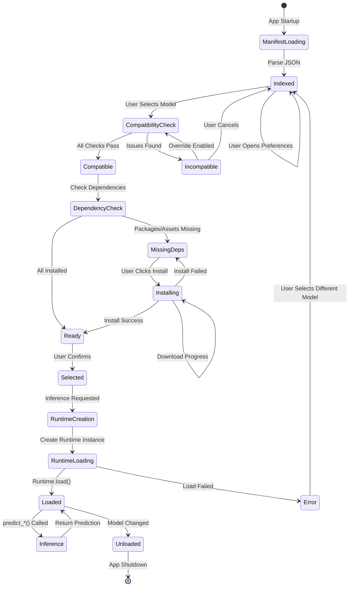
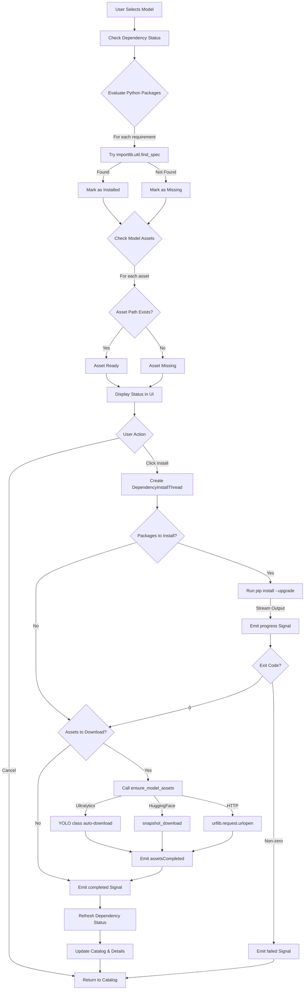

# AI/Model System Analysis

## Overview

The AI/Model system manages the complete lifecycle of AI models in DataLens, from manifest loading and compatibility checking to runtime instantiation and inference execution. The system is built around a hierarchical model organization (families → tasks → sizes) with comprehensive dependency management, asset downloading, and user-defined variant support.

## Core Components

### 1. AIModelManager (`ai/manager.py`)

**Purpose**: Central orchestrator for all AI model operations

**Key Responsibilities**:
- Load and parse the models manifest (JSON)
- Validate model compatibility with system hardware
- Manage model selection and runtime lifecycle
- Handle dependency checking and asset management
- Support user-defined model variants
- Detect system specifications (RAM, GPU, CUDA)

**Architecture**:
```
AIModelManager
├── Manifest Loading
│   ├── Parse dependency bundles
│   ├── Parse model families
│   └── Build specification index
├── Compatibility Checking
│   ├── RAM requirements
│   ├── VRAM requirements
│   ├── CUDA version checking
│   └── Dependency validation
├── Runtime Management
│   ├── Runtime registry (class-level)
│   ├── Runtime instantiation
│   └── Inference delegation
├── Asset Management
│   ├── Ultralytics weights
│   ├── SAM2 checkpoints
│   └── HTTP downloads
└── Variant Management
    ├── Variant storage (JSON)
    ├── Variant creation
    └── Published weights
```


**State Management**:
- `_base_records`: Dict[str, ManifestRecord] - Base model specifications with variants
- `_spec_index`: Dict[str, ModelSpecification] - All specifications by identifier
- `_variants`: Dict[str, ModelVariant] - User-defined variants
- `_dependency_bundles`: Dict[str, ModelDependencyBundle] - Reusable dependency sets
- `_families`: Dict[str, ModelFamily] - Model family definitions
- `_family_records`: Dict[str, FamilyCatalog] - Organized family catalogs
- `_category_index`: Dict[str, set[str]] - Category to family mapping
- `_dependency_status_cache`: Dict[str, List[DependencyStatus]] - Cached dependency checks
- `_asset_requirements`: Dict[str, List[ModelAssetInfo]] - Asset metadata per model
- `_selected_model_id`: Optional[str] - Currently selected model
- `_runtime`: Optional[ModelRuntime] - Active runtime instance
- `_favorites`: set[str] - User-favorited model IDs
- `_system`: SystemSpecifications - Detected hardware capabilities

**Signals** (Qt):
- `selectionChanged(object)` - Emitted when model selection changes
- `runtimeStateChanged()` - Emitted when runtime loads/unloads
- `dependenciesChanged(object)` - Emitted when dependency status refreshes

**Key Methods**:

*Model Registry*:
- `register_runtime(identifier, runtime_cls, ...)` - Register runtime class (class method)
- `available_models()` - List all available model specifications
- `grouped_models()` - List base models with their variants
- `model_specification(model_id)` - Get specification by ID
- `categories()` - List all model categories
- `families_for_category(category)` - Get families in a category
- `family_catalog(family_id)` - Get family catalog with tasks

*Selection & Validation*:
- `select_model(model_id, allow_override)` - Select a model for use
- `compatibility_issues(model_id)` - Check hardware compatibility
- `installation_issues(model_id)` - Check installable issues only
- `dependency_status(model_id)` - Get dependency bundle status
- `refresh_dependency_status(model_id)` - Invalidate cached status

*Runtime Management*:
- `ensure_model_loaded()` - Load selected model runtime
- `unload_model()` - Unload current runtime
- `is_model_loaded()` - Check if runtime is ready
- `build_runtime_for_spec(spec)` - Create runtime without selection
- `runtime_supports_detection(model_id)` - Check detection capability
- `runtime_supports_prompt(model_id)` - Check prompt capability

*Inference*:
- `predict_point_prompt(image, point)` - Point-based segmentation
- `predict_box_prompt(image, box)` - Box-based segmentation
- `detect_objects(image)` - Object detection


*Asset Management*:
- `model_assets(model_id)` - Get asset info for model
- `missing_assets(model_id)` - Get uninstalled assets
- `ensure_model_assets(model_id, progress, is_cancelled)` - Download missing assets

*Favorites*:
- `is_favorite(model_id)` - Check favorite status
- `set_favorite(model_id, enabled)` - Toggle favorite
- `favorite_model_ids()` - List favorite IDs
- `favorite_models()` - List favorite specifications
- `validate_favorites(published_root)` - Check for missing weights

*Variants*:
- `create_variant(base_id, display_name, weights_path, ...)` - Create variant
- `publish_variant_from_source(base_id, display_name, source_path, ...)` - Publish variant

*System Detection*:
- `system_specifications()` - Get detected hardware
- `_detect_system_specs()` - Detect RAM, GPU, CUDA
- `_detect_total_ram_gb()` - Detect system RAM
- `_detect_gpu_model_names()` - Detect GPU names
- `_detect_gpu_devices()` - Detect GPU with VRAM/compute capability
- `_detect_cuda_versions()` - Detect CUDA driver/runtime versions

**Manifest Loading Flow**:
1. Load JSON from `models_manifest.json`
2. Parse `dependency_bundles` section into ModelDependencyBundle objects
3. Parse `families` section:
   - Create ModelFamily objects
   - For each family, parse tasks (ModelTaskVariant)
   - For each task, parse sizes (ModelSizeOption)
   - Build ModelSpecification for each size
4. Parse legacy `models` array (if present)
5. Index all specifications by identifier
6. Attach specs to family catalogs
7. Build category index

**Compatibility Checking Algorithm**:
1. Check RAM: `system_ram >= spec.min_ram_gb`
2. Check VRAM: `max_gpu_vram >= spec.min_vram_gb` (if specified)
3. Check compute capability: `max_compute_cap >= spec.min_compute_capability` (if specified)
4. Check GPU model: GPU name contains any supported GPU token
5. Check CUDA version: `detected_version >= spec.requires_cuda` (if specified)
6. Check dependencies: All Python packages importable
7. Check assets: All weights/checkpoints present
8. Check variant weights: Published weights file exists

**Asset Download Strategies**:
- **Ultralytics**: Call `YOLO(weights_name)` to trigger auto-download
- **Hugging Face**: Use `snapshot_download(repo_id, cache_dir)`
- **HTTP**: Direct `urllib.request.urlopen()` with chunked download

**Variant System**:
- Variants are user-defined models based on existing base models
- Stored in `model_variants.json` alongside manifest
- Support custom weights paths (published or external)
- Inherit all properties from base model except weights
- Can override metadata fields via `overrides` dict
- Track origin information (training run, manual, etc.)


### 2. Model Types (`ai/types.py`)

**Purpose**: Define all data structures for model specifications and system capabilities

**Key Dataclasses**:

**BoundingBox**:
- Represents detection/segmentation result
- Fields: x, y, width, height, score, label
- Method: `clamp(max_width, max_height)` - Constrain to image bounds

**ModelPrediction**:
- Normalized inference result
- Fields: boxes (List[BoundingBox]), metadata (Dict)

**ModelDependencyBundle**:
- Named collection of dependencies
- Fields: identifier, python (List[str]), system (List[str]), notes
- Methods: `from_dict()`, `as_dict()`, `clone()`

**ModelSizeOption**:
- Concrete size variant within a task
- Fields: identifier, name, runtime, min_ram_gb, min_vram_gb, min_compute_capability, supported_gpus, requires_cuda, metadata, dependencies, supports_training, notes
- Method: `from_dict(payload)`

**ModelTaskVariant**:
- Task specialization (detection vs segmentation)
- Fields: identifier, name, runtime, description, default_size, requirements, dependencies, sizes (Dict[str, ModelSizeOption])
- Method: `from_dict(payload)`

**ModelFamily**:
- Top-level grouping of related models
- Fields: identifier, name, description, metadata, dependencies, supports_training, requirements, tasks (Dict[str, ModelTaskVariant])
- Methods: `from_dict()`, `build_specifications()` - Generate specs for all task/size combinations

**ModelSpecification**:
- Complete model definition
- Fields: identifier, name, description, runtime, requirements (RAM/VRAM/compute), supported_gpus, requires_cuda, metadata, base_identifier, weights_path, display_name, notes, family_id, task_id, size_key, dependency_ids, dependency_bundles, training_support
- Properties: `effective_display_name`, `is_variant`, `supports_training`
- Methods: `from_dict()`, `as_dict()`, `clone()`

**ModelVariant**:
- User-defined variant metadata
- Fields: identifier, base_identifier, display_name, weights_path, notes, overrides, origin
- Methods: `from_dict()`, `to_dict()`

**GPUDevice**:
- Detected GPU with capabilities
- Fields: name, vram_gb, compute_capability
- Method: `summary()` - Human-readable description

**SystemSpecifications**:
- Runtime system capabilities
- Fields: total_ram_gb, gpu_models, gpu_devices, cuda_driver_version, cuda_runtime_version
- Properties: `gpu_model`, `cuda_version` (backwards compat)
- Methods: `summary()`, `detected_cuda_versions()`, `max_gpu_vram_gb()`, `max_compute_capability()`


### 3. Models Manifest (`ai/models_manifest.json`)

**Purpose**: Declarative model catalog with hierarchical organization

**Schema Structure**:
```json
{
  "dependency_bundles": {
    "<bundle_id>": {
      "python": ["package>=version", ...],
      "system": ["system-package", ...],
      "notes": "Installation instructions"
    }
  },
  "families": [
    {
      "id": "family-id",
      "name": "Family Name",
      "description": "...",
      "metadata": {"categories": [...], "featured": true},
      "dependencies": ["bundle-id", ...],
      "tasks": [
        {
          "id": "task-id",
          "name": "Task Name",
          "runtime": "runtime-id",
          "default_size": "size-id",
          "sizes": [
            {
              "id": "size-id",
              "name": "Size Name",
              "size": "n|s|m|l|x",
              "min_ram_gb": 4.0,
              "min_vram_gb": 4.0,
              "metadata": {
                "weights": "filename.pt",
                "download_url": "https://...",
                "confidence_threshold": 0.25
              }
            }
          ]
        }
      ]
    }
  ]
}
```

**Current Families**:
1. **SAM (Segment Anything)**:
   - Tasks: sam2-point, sam21-point
   - Sizes: small, base, large (Hiera variants)
   - Runtime: sam2
   - Dependencies: sam2-core, http-charset

2. **YOLO (Object Detection)**:
   - Tasks: yolov7-detection, yolov8-detection, yolov9-detection, yolov10-detection, yolov11-detection, yolov12-detection
   - Sizes: nano, small, medium, large, extra-large (varies by version)
   - Runtimes: yolov7, yolov8, yolov9, yolov10, yolov11, yolov12
   - Dependencies: ultralytics, http-charset

**Dependency Bundles**:
- `sam2-core`: SAM 2 reference implementation (sam2>=1.1)
- `ultralytics`: YOLO runtimes (ultralytics>=8.3)
- `http-charset`: Charset detection for HTTP downloads (charset-normalizer>=3.3)

**Metadata Fields**:
- `categories`: List of category tags for organization
- `featured`: Boolean flag for featured models
- `weights`: Filename of model weights
- `download_url`: Direct download URL for weights
- `config_file`: SAM2 config file path
- `confidence_threshold`: Default detection threshold
- `image_size`: Input image size
- `input_format`: Expected color format (RGB)
- `prompt_type`: Prompt modality (point, box)


### 4. Dependency Installation (`ai/install.py`)

**Purpose**: Background thread for installing Python packages and downloading assets

**DependencyInstallThread** (extends QThread):

**Constructor Parameters**:
- `packages`: Iterable[str] - Python packages to install via pip
- `python_executable`: Optional[str] - Python interpreter path (defaults to sys.executable)
- `install_assets`: Optional callback - Function to download model assets
- `asset_descriptions`: Optional[Iterable[str]] - Human-readable asset names

**Signals**:
- `started(list)` - Emitted when pip install begins (package list)
- `progress(str)` - Emitted for each line of pip output
- `completed(int, list)` - Emitted when complete (return code, packages)
- `failed(str)` - Emitted on error (error message)
- `assetsStarted(list)` - Emitted when asset download begins (descriptions)
- `assetsCompleted(list)` - Emitted when assets finish (descriptions)

**Workflow**:
1. If packages provided:
   - Build pip command: `python -m pip install --upgrade <packages>`
   - Start subprocess with stdout piped
   - Stream output lines via `progress` signal
   - Wait for completion
   - Emit `completed` with return code
2. If `install_assets` callback provided:
   - Emit `assetsStarted` with descriptions
   - Call callback with progress/cancellation hooks
   - Emit `assetsCompleted` with installed asset list
3. Check for cancellation at each stage
4. Emit `failed` on any exception

**Cancellation**:
- `cancel()` method sets `_cancel_requested` flag
- Terminates running pip process (SIGTERM, then SIGKILL after 3s)
- Callback checks `_is_cancelled()` to abort downloads

**Error Handling**:
- Subprocess failures emit `failed` signal
- Non-zero pip exit codes emit `completed` with error code
- Asset download exceptions emit `failed` signal
- Cancellation emits `failed` with "Installation cancelled"


### 5. Model Preferences Dialog (`ai/preferences_dialog.py`)

**Purpose**: UI for browsing, selecting, and installing AI models

**ModelPreferencesDialog** (extends QDialog):

**Constructor Parameters**:
- `parent`: Parent widget
- `manager`: AIModelManager instance
- `theme`: Optional AppTheme

**UI Components**:
- System summary label (RAM, GPU, CUDA)
- Override compatibility checkbox
- Model catalog list (left pane) - ModelCatalogList widget
- Model details text (right pane) - QTextEdit
- Install button with status label
- Install log (collapsible QTextEdit)
- Clone variant button
- Cancel/OK buttons

**State Management**:
- `_install_thread`: Optional[DependencyInstallThread] - Active install thread
- `_installing_model_id`: Optional[str] - Model being installed
- `_install_last_result_failed`: bool - Last install failed flag
- `_installing_assets`: list[str] - Asset descriptions being downloaded
- `_downloaded_assets`: list[str] - Successfully downloaded assets
- `_catalog_status`: dict[Optional[str], SpecStatus] - Availability status per model
- `_favorite_state`: dict[str, bool] - Favorite flags per model
- `_catalog_tooltips`: dict[Optional[str], str] - Tooltip text per model

**Key Methods**:

*Catalog Population*:
- `_populate_catalog(preserve_selection)` - Rebuild catalog from manager
  - Evaluate compatibility for all models
  - Compute dependency status
  - Build tooltips with requirements/issues
  - Update catalog list widget
  - Apply override state to enable/disable cards

*Selection Handling*:
- `_on_catalog_selection_changed(model_id)` - Update details pane
- `_update_details_from_selection()` - Render model info
  - Display name, description, notes
  - Show capabilities (prompt, detection)
  - List requirements (RAM, VRAM, compute, CUDA)
  - Show dependency bundles with status
  - List model assets with install status
  - Display detected system specs
  - Show compatibility issues
  - Show warnings for undetected hardware

*Installation*:
- `_on_install_dependencies()` - Start install thread
  - Collect missing packages from dependency status
  - Collect missing assets from asset list
  - Create DependencyInstallThread with callbacks
  - Connect signals to progress handlers
  - Start thread
- `_on_install_started(packages)` - Log pip command
- `_on_install_progress(line)` - Append to log
- `_on_assets_started(assets)` - Log asset download start
- `_on_assets_finished(assets)` - Log asset completion
- `_on_install_finished(returncode, packages)` - Handle completion
  - Refresh dependency status on success
  - Update all model availability
  - Update details pane
- `_on_install_failed(message)` - Log error
- `_cancel_install_thread()` - Terminate running install


*Variant Creation*:
- `_on_clone_variant()` - Open variant creation dialog
  - Get base model specification
  - Show _VariantCreationDialog
  - Call `manager.publish_variant_from_source()`
  - Refresh catalog with new variant selected

*Override Management*:
- `_on_override_toggled(state)` - Update override flag
  - Apply override state to catalog (enable/disable incompatible models)
  - Refresh details pane
- `_apply_override_state()` - Enable/disable cards based on override

*Favorites*:
- `_on_favorite_toggled(model_id, enabled)` - Toggle favorite
  - Update manager favorite state
  - Refresh catalog preserving selection

*Install Button Styling*:
- `_update_install_controls(spec, statuses)` - Update button appearance
  - Disabled: "Install missing packages" (gray)
  - Installing: "Installing…" (primary, disabled)
  - Missing deps/assets: "Install dependencies and weights" (red, enabled)
  - Installed: "Installed" (green, disabled)
- `_style_install_button(...)` - Apply colors and text

**_VariantCreationDialog** (extends QDialog):

**Purpose**: Collect metadata for creating a model variant

**UI Components**:
- Variant name input (QLineEdit)
- Weights file path input with browse button
- Notes text area (QTextEdit)
- Cancel/Create buttons

**Validation**:
- Name must be non-empty
- Weights path must be non-empty
- Weights file must exist (validated by manager)

**Workflow**:
1. User enters variant name
2. User browses for weights file
3. User enters optional notes
4. On accept, return values to parent dialog
5. Parent calls `manager.publish_variant_from_source()`


## Model Lifecycle Diagram



## Dependency Management Flow Diagram




## Integration Points

### With Application Core
- **App Initialization**: AIModelManager created with manifest path and initial state from user storage
- **User Storage**: Model selection, favorites, override flag, dialog sizes persisted via `snapshot_state()`
- **Event Hub**: No direct event hub integration (uses Qt signals)

### With UI Layer
- **ModelPreferencesDialog**: Primary UI for model management
- **ModelCatalogList**: Custom widget for displaying model cards with status
- **SpecStatus**: Evaluation helper for determining model availability
- **AnnotationTab**: Calls `manager.ensure_model_loaded()` before AI-assisted operations
- **TrainTab**: Publishes variants after training completion

### With Training System
- **Training Completion**: Creates variants from trained weights
- **Variant Publishing**: `publish_variant_from_source()` with origin tracking
- **Training Support Flag**: `spec.supports_training` determines if model can be trained

### With Runtime Layer
- **Runtime Registry**: Runtimes register via `AIModelManager.register_runtime()`
- **Runtime Instantiation**: Manager creates runtime instances via registry
- **Inference Delegation**: Manager delegates to active runtime for predictions

## Data Flow

### Model Selection Flow
1. User opens ModelPreferencesDialog
2. Dialog calls `manager.available_models()` to populate catalog
3. For each model, dialog calls `manager.compatibility_issues()` and `manager.dependency_status()`
4. User selects model, dialog displays details
5. User clicks OK, dialog calls `manager.select_model()`
6. Manager validates compatibility (unless override enabled)
7. Manager unloads current runtime
8. Manager updates `_selected_model_id`
9. Manager emits `selectionChanged` signal
10. App persists selection via user storage

### Inference Flow
1. AnnotationTab receives user interaction (point click, box draw)
2. Tab calls `manager.ensure_model_loaded()`
3. Manager checks if `_runtime` exists and is loaded
4. If not, manager creates runtime via `_create_runtime()`
5. Manager calls `runtime.load()`
6. Manager emits `runtimeStateChanged` signal
7. Manager returns runtime instance
8. Tab calls `manager.predict_point_prompt()` or `manager.predict_box_prompt()`
9. Manager delegates to `runtime.predict_*()`
10. Runtime returns ModelPrediction with bounding boxes
11. Tab renders prediction on canvas

### Asset Download Flow
1. User clicks "Install" button in ModelPreferencesDialog
2. Dialog collects missing packages and assets
3. Dialog creates DependencyInstallThread with:
   - Missing package list
   - Asset install callback wrapping `manager.ensure_model_assets()`
4. Thread starts, runs pip install
5. Thread streams output via `progress` signal
6. Dialog appends to install log
7. On pip completion, thread calls asset callback
8. Callback calls `manager.ensure_model_assets()`
9. Manager iterates missing assets, downloads each
10. Manager emits progress via callback
11. Thread emits `assetsCompleted` signal
12. Thread emits `completed` signal
13. Dialog calls `manager.refresh_dependency_status()`
14. Dialog refreshes catalog and details


## Complexity Analysis

### AIModelManager Complexity
- **Lines of Code**: ~2100 lines
- **Methods**: 80+ methods
- **State Variables**: 15+ instance variables
- **Dependencies**: 
  - PySide6 (Qt signals)
  - numpy (inference)
  - pathlib, json, subprocess, urllib (system operations)
  - Runtime implementations (dynamic)

**Complexity Hotspots**:
1. **Manifest Loading** (~200 lines): Complex nested parsing of families/tasks/sizes
2. **Compatibility Checking** (~150 lines): Multiple hardware checks with fallbacks
3. **System Detection** (~400 lines): Platform-specific GPU/CUDA detection
4. **Asset Management** (~300 lines): Multiple download strategies
5. **Variant Management** (~200 lines): Variant creation, publishing, merging

### ModelPreferencesDialog Complexity
- **Lines of Code**: ~900 lines
- **Methods**: 30+ methods
- **State Variables**: 10+ instance variables
- **UI Components**: 15+ widgets

**Complexity Hotspots**:
1. **Catalog Population** (~100 lines): Evaluate all models, build status/tooltips
2. **Details Rendering** (~150 lines): Format comprehensive model information
3. **Install Management** (~200 lines): Thread lifecycle, progress tracking
4. **Install Button Styling** (~80 lines): Dynamic appearance based on state

### Dependency Patterns
```
AIModelManager
├── Depends on: types.py (all dataclasses)
├── Depends on: runtime_base.py (ModelRuntime)
├── Depends on: runtimes/ (runtime implementations)
├── Depends on: user_storage.py (persistence)
└── Used by: preferences_dialog.py, annotation_tab.py, train_tab.py

ModelPreferencesDialog
├── Depends on: manager.py (AIModelManager)
├── Depends on: install.py (DependencyInstallThread)
├── Depends on: types.py (ModelSpecification)
├── Depends on: ui/ai/model_cards.py (ModelCatalogList)
├── Depends on: ui/ai/spec_status.py (evaluate_spec_status)
└── Used by: main_window.py (preferences menu)

DependencyInstallThread
├── Depends on: PySide6.QtCore (QThread, Signal)
├── Depends on: subprocess (pip execution)
└── Used by: preferences_dialog.py

types.py
├── No internal dependencies
└── Used by: manager.py, preferences_dialog.py, runtime_base.py, all runtimes
```

## Design Patterns

### Registry Pattern
- **Runtime Registry**: Class-level dict mapping runtime IDs to RuntimeDescriptor
- Runtimes register via `AIModelManager.register_runtime()`
- Loaded at module import via `load_builtin_runtimes()`
- Enables dynamic runtime discovery and instantiation

### Factory Pattern
- **Runtime Creation**: `_create_runtime()` instantiates runtime from registry
- **Specification Building**: `ModelFamily.build_specifications()` generates specs from hierarchy

### Observer Pattern
- **Qt Signals**: Manager emits signals for selection/runtime/dependency changes
- UI components connect to signals for reactive updates

### Strategy Pattern
- **Asset Download**: Different strategies for Ultralytics, HuggingFace, HTTP
- Selected based on `asset.source` field

### Facade Pattern
- **AIModelManager**: Provides unified interface to complex subsystems
- Hides manifest parsing, compatibility checking, asset management complexity


## Threading Model

### Main Thread
- AIModelManager instance creation and method calls
- Qt signal emission
- UI rendering (ModelPreferencesDialog)
- Manifest loading (synchronous)
- Compatibility checking (synchronous)
- Runtime creation and loading (synchronous)

### Background Threads
- **DependencyInstallThread**: Runs pip install and asset downloads
  - Subprocess for pip (stdout piped)
  - HTTP downloads (blocking urllib calls)
  - Cancellation via flag and process termination

### Thread Safety
- AIModelManager is NOT thread-safe (designed for main thread only)
- DependencyInstallThread communicates via Qt signals (thread-safe)
- Asset download callback checks cancellation flag (thread-safe)

## Error Handling

### AIModelManager Errors
- **ModelError**: Base exception for all model-related errors
- **ModelNotSelectedError**: No model selected when operation requires one
- **ModelCompatibilityError**: Model incompatible with hardware
- **ModelRuntimeError**: Runtime failed to load or execute

**Error Strategies**:
- Manifest loading errors: Raise ModelError, prevent app startup
- Compatibility issues: Return list of issues, allow override
- Runtime loading errors: Catch, log, raise ModelRuntimeError
- Inference errors: Catch, log, raise ModelRuntimeError
- Asset download errors: Raise ModelError with details

### DependencyInstallThread Errors
- Subprocess failures: Emit `failed` signal with exception message
- Non-zero pip exit: Emit `completed` with error code
- Asset download failures: Emit `failed` signal
- Cancellation: Emit `failed` with "Installation cancelled"

### ModelPreferencesDialog Errors
- Catalog population failure: Show critical message, disable catalog
- Dependency evaluation failure: Show "Availability check failed" in status
- Install failure: Display in status label and log
- Variant creation failure: Show critical message with error

## Performance Considerations

### Caching
- **Dependency Status**: Cached per model ID, invalidated on refresh
- **System Specifications**: Detected once at manager creation
- **Manifest**: Loaded once at startup, not reloaded

### Optimization Opportunities
1. **Lazy Loading**: Defer runtime creation until first inference
2. **Parallel Compatibility Checks**: Check multiple models concurrently
3. **Incremental Catalog Updates**: Only re-evaluate changed models
4. **Asset Verification**: Cache asset existence checks

### Performance Bottlenecks
1. **System Detection**: GPU/CUDA detection via subprocess (100-500ms)
2. **Compatibility Checking**: Repeated for all models on catalog open
3. **Asset Downloads**: Large files (100MB-1GB) over HTTP
4. **Runtime Loading**: Model weight loading (1-10s depending on size)


## Configuration and Extensibility

### Environment Variables
- `RSCAPTURE_MODEL_VARIANTS_PATH`: Override variant storage path
- `RSCAPTURE_TOTAL_RAM_GB`: Override detected RAM
- `RSCAPTURE_GPU_MODEL`: Override detected GPU names (comma-separated)
- `RSCAPTURE_GPU_CAPABILITIES`: Override GPU specs (name:vram:compute;...)
- `RSCAPTURE_CUDA_DRIVER_VERSION`: Override CUDA driver version
- `RSCAPTURE_CUDA_RUNTIME_VERSION`: Override CUDA runtime version
- `RSCAPTURE_CUDA_VERSION`: Legacy CUDA version override
- `ULTRALYTICS_HOME`: Ultralytics cache directory
- `YOLO_HOME`: YOLO cache directory (alias)
- `HF_HOME`: Hugging Face cache directory
- `HUGGINGFACE_HUB_CACHE`: HF hub cache
- `TRANSFORMERS_CACHE`: Transformers cache
- `TORCH_HOME`: PyTorch cache directory

### Adding New Models
1. Add entry to `models_manifest.json`:
   - Define in existing family or create new family
   - Specify task variant
   - Define size options with requirements
   - Set metadata (weights, download_url, etc.)
2. Ensure runtime is registered for the specified runtime ID
3. Add dependency bundle if new dependencies required
4. Test compatibility checking and asset download

### Adding New Runtimes
1. Create runtime class extending `ModelRuntime`
2. Implement required methods: `load()`, `unload()`, `is_loaded()`, `predict_point_prompt()`
3. Optionally implement: `predict_box_prompt()`, `detect_objects()`, `menu_groups()`
4. Register runtime: `AIModelManager.register_runtime(id, cls, supports_prompt=..., supports_detection=...)`
5. Call registration in `load_builtin_runtimes()` or at module import

### Variant Workflow
1. User trains model or obtains custom weights
2. User opens ModelPreferencesDialog
3. User selects base model and clicks "Clone variant…"
4. User provides name, weights path, notes
5. Dialog calls `manager.publish_variant_from_source()`
6. Manager copies/moves weights to published directory
7. Manager creates ModelVariant with metadata
8. Manager builds ModelSpecification from base + variant
9. Manager saves variants to `model_variants.json`
10. Variant appears in catalog for future selection

## Files Analyzed

- `src/datalens/ai/manager.py` (2100 lines)
- `src/datalens/ai/types.py` (900 lines)
- `src/datalens/ai/models_manifest.json` (600 lines)
- `src/datalens/ai/install.py` (130 lines)
- `src/datalens/ai/preferences_dialog.py` (900 lines)

**Total**: ~4630 lines across 5 files

## Summary

The AI/Model system is a comprehensive, hierarchical model management framework with:
- Declarative manifest-based model catalog
- Hardware compatibility validation with override support
- Automatic dependency and asset management
- User-defined variant support with published weights
- Background installation with progress tracking
- Rich UI for model browsing and configuration

The system successfully abstracts runtime complexity while providing flexibility for adding new models and runtimes. The main complexity lies in the compatibility checking logic and the multi-strategy asset download system. The variant system enables seamless integration with the training workflow, allowing users to promote trained models to first-class catalog entries.
