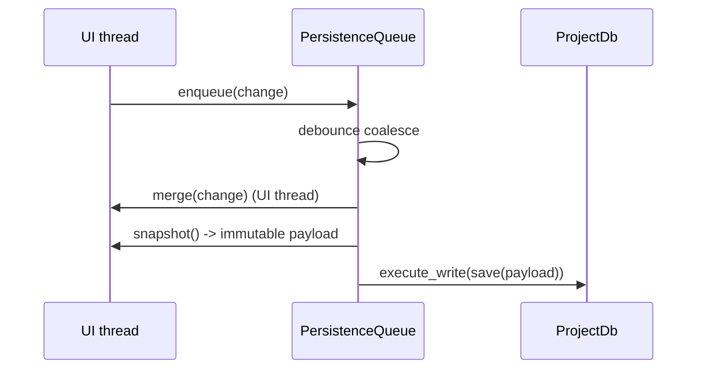

# Project DB + Async Persistence (V2 plan)

This document defines the V2 plan for **project-scoped persistence** with a focus on:

- performance (no UI freezes)
- correctness (consistent saves)
- plugin ergonomics (simple APIs; no globals; no plugin-to-plugin imports)

It builds on what V1 already proved (debounced background saves) while moving project state toward a **single SQLite database per project**.

## Robustness contract (non-negotiables)

### 1) No UI-thread IO (ever)

- The UI thread must never block on:
  - SQLite open/config/migrations
  - disk reads/writes (JSON, exports, caches, etc.)
- UI code must not call `Future.result()` on DB/IO futures.
- All heavy work happens in background systems; UI receives results via callbacks/signals.

### 2) Core app never mutates plugin-owned tables

- The core app only owns and migrates **core tables** (initially `app_meta` and `plugin_kv`).
- The core app must never drop/alter/delete plugin-owned tables or plugin-owned rows.
- Core "project open" is **inspect-first** (read-only) and only migrates when required.

### 3) Migrations are conservative and fail fast

- If the DB schema is incompatible: fail fast with a clear error and do not modify the DB.
- Core migrations should be additive where possible (create tables, add columns) and avoid destructive operations.
- Plugin migrations (plugin-owned tables) are initiated and managed by the plugin itself.

### 4) Close/exit must not lose authoritative data

- When a project closes (or the app exits), pending persistence work must be:
  - awaited/flushed successfully, or
  - surfaced as an error (so the UI can warn the user / offer retry).
- "Best effort" writes are acceptable only for **derived artifacts** (e.g. `project_meta.json`), never for authoritative state.

#### Plugin-aware close sequence (required)

Plugins may run their own background pipelines (capture queues, model workers, exporters).
The host must provide a consistent shutdown sequence so plugins can flush their
pending work before the shared persistence infrastructure is torn down.

Required close order:

1. Ask plugins to flush/stop (so they can enqueue final DB writes).
2. Flush the project DB executor (`ProjectDb.flush()`), ensuring all queued transactions are committed.
3. Flush the file IO writer (`IoWriter.flush()`), ensuring queued file writes are committed.
4. Close resources (DB connection/thread, IO thread, plugin workers).

Notes:

- This must run off the UI thread (use the loader/background pipeline).
- If any flush fails, surface the error (do not silently drop authoritative data).

## What V1 does (baseline)

V1's key persistence improvement is the `PersistenceQueue` pattern (see `docs/annotation_persistence.md`):

1. **Merge**: apply changes on the UI thread
2. **Snapshot**: build an immutable payload on the UI thread
3. **Save**: write to disk on a background worker thread

This avoids:

- blocking the UI on disk I/O
- race conditions where the background thread reads half-mutated state
- excessive disk churn (debounce coalesces frequent edits)

## When snapshotting is required

Snapshotting is required whenever you have **mutable state that changes frequently** and you need to persist a consistent view:

- annotation editing (many UI events per second)
- project indexes derived from multiple sources (filesystem + caches)
- any save that needs to read multiple in-memory objects "atomically"

Snapshotting is less critical for a small payload that is already constructed (e.g. a dict you just built), but even then the best practice is:

- construct payload first (snapshot boundary)
- enqueue persistence second (DB/IO stage)

## V2 target model (project-scoped)

### Project layout

- Project root: user-chosen directory
- Project data dir: `<project_root>/.datalens/`
  - Project DB: `<project_root>/.datalens/project.sqlite`
  - Project meta (derived): `<project_root>/.datalens/project_meta.json`

Paths live in `datalens/infra/project_paths.py`.

### SQLite is authoritative; JSON is derived

- SQLite stores the authoritative metadata and schema version.
- `project_meta.json` is derived from SQLite and can be deleted/recreated.

## Ownership boundaries (core vs plugins)

### Core-owned tables (reserved)

The core app owns and may migrate these tables:

- `app_meta` (core/db versioning and timestamps)
- `plugin_kv` (namespaced key/value JSON by `plugin_id`)
- `plugin_meta` (plugin version + plugin schema version tracking)

Core code may create/migrate these tables, but must not touch plugin-owned tables.

### plugin_meta (core-owned, plugin-managed rows)

To allow app developers to track plugin persistence evolution (and allow plugins
to migrate their own tables), we add a core-owned table:

- `plugin_meta(plugin_id TEXT PRIMARY KEY, plugin_version TEXT, schema_version INTEGER, updated_at TEXT)`

Status: implemented (core schema v2).

Rules:

- The core app may create/migrate the `plugin_meta` table itself (table ownership).
- The core app must never write plugin rows on its own (row ownership belongs to the plugin).
- Each plugin updates only its own row (`plugin_id`) as part of its own migration
  flow once a project is open.

This allows:

- auditing which plugin schema versions exist in a project without scanning plugin tables
- plugin-driven migrations without any core coupling to plugin schemas

### Plugin-owned tables

Plugins may create and migrate their own tables. The core app must treat these as opaque.

Recommendations for plugin authors:

- Namespace table names to avoid collisions (e.g. prefix with plugin id or a consistent scheme we standardise later).
- Store per-plugin schema version in either:
  - `plugin_meta.schema_version` (preferred once implemented), and/or
  - `plugin_kv` under a reserved key (e.g. `__schema_version__`) for lightweight state.

## Core objectives

### Objective A: safe, consistent SQLite access

**Single-writer model per project** (starting point):

- one background thread
- one SQLite connection owned by that thread
- both reads and writes run on that thread initially (simplest + safest)
- later: upgrade reads to a pool behind the same API if needed

### Objective B: plugin-friendly APIs (namespaced)

Plugins should not import global singletons. They use an injected context (`self.ctx`) that provides access to project persistence services.

Minimal plugin-facing API:

- `ProjectDb.execute_write(fn(conn)) -> Future`
- `ProjectDb.execute_read(fn(conn)) -> Future`
- `ProjectDb.kv_get(plugin_id, key) -> Future[object | None]`
- `ProjectDb.kv_set(plugin_id, key, value) -> Future[None]`
- `ProjectDb.plugin_meta_get(plugin_id) -> Future[PluginMeta | None]`
- `ProjectDb.plugin_meta_set(plugin_id, plugin_version=..., schema_version=...) -> Future[None]`

Notes:

- `kv_*` covers most plugin needs for small state without requiring ad-hoc tables.
- Raw SQL is an escape hatch, not the default.
- The callable passed to `execute_*` runs on the DB executor thread; it must not touch Qt widgets or UI state.
- For plugin-owned rows in core-owned tables, prefer a plugin-scoped wrapper (`PluginDb`) so plugins cannot accidentally write another plugin's rows.

### Objective C: clear lifecycle + gating

If no project is open:

- `ctx.active_project` is `None`
- project DB access is unavailable (raise `NoActiveProjectError`)

This prevents accidental writes before a project exists.

## Planned components (V2)

### 1) DB gateway (`services/db/gateway.py`)

Responsibilities:

- open/configure SQLite connections consistently
- apply pragmas:
  - `foreign_keys = ON`
  - `journal_mode = WAL` (write connections)
  - `synchronous = NORMAL`
  - `busy_timeout`
- small helpers:
  - `execute`, `query_one`, `query_all`
  - `transaction()` context manager

Status: implemented.

### 2) Project DB executor (`services/db/project_db.py`)

Responsibilities:

- implement `ProjectDb` (plugin-facing interface)
- run queued callables on a single DB thread/connection
- provide plugin KV table (`plugin_kv`)

Status: implemented (initial).

Hardening tasks (to make this "complete"):

- remove UI-blocking waits from constructors and UI flows (no `.result()` on UI thread)
- add lifecycle guarantees:
  - `flush()` / `close(flush=True)` so callers can guarantee all queued writes are committed
  - better shutdown behavior (drain queue deterministically; surface errors)
- optional (later): split reads into a read-only pool while preserving the API

### 3) Core schema + metadata (`services/db/migrations_runner.py`)

Responsibilities:

- ensure core schema exists in one place (not scattered)
- create/maintain:
  - `app_meta` table (app version + DB schema version)
  - `plugin_kv` table (key/value JSON by plugin id)
  - `plugin_meta` table (plugin versions + plugin schema versions; core creates table, plugins own rows)
- version checks (fail fast on incompatible schema)
- optional: run plugin migrations (later, plugin-driven)

Status: implemented (initial).

Hardening tasks:

- implement real compatibility checks:
  - if `PRAGMA user_version` is newer than supported, fail without writing
  - if older, migrate core tables only (no plugin tables)
- separate "inspect" vs "migrate":
  - inspect uses a read-only connection and never writes
  - migrate uses a write connection and touches core tables only

### 4) Derived project meta JSON (`project_meta.json`)

Responsibilities:

- derive meta from SQLite (`app_meta`, plus optional table listing)
- write to `<project_root>/.datalens/project_meta.json` atomically

Design notes:

- Write via the generic async IO writer.
- Best-effort only (derived artifact): failure must not prevent project open.

Status: implemented (initial).

Hardening tasks:

- ensure meta generation never blocks UI (trigger it after DB is ready; do not wait in UI code)

### 5) Async file writer (generic I/O)

Why:

- plugins will need to write files without freezing the UI (exports, manifests, caches, etc.)

Design:

- an `IoWriter`/`FileWriter` service (background queue) for small/medium writes
- helpers: `write_json_atomic`, `write_text_atomic`, `write_bytes_atomic`

Notes:

- high-rate media capture (frames/video) must use a dedicated capture/recording pipeline, not the generic IO queue

Status: implemented (initial).

Hardening tasks:

- add `flush()` semantics so the app can guarantee completion before exit
- decide on a single "file write" story across the app (avoid multiple competing writers):
  - either unify settings writes onto the same IO writer, or
  - explicitly document why settings uses a dedicated debounced writer

### 6) Snapshotting persistence queue (for large mutable state)

Why:

- DB/file executors alone do not solve "consistent snapshot" problems.

Design:

- V2 `PersistenceQueue` generalised from V1:
  - merge -> snapshot -> save
  - debounced/coalesced
  - uses `ProjectDb` and/or `IoWriter` for the final save stage

Status: implemented (initial) as `datalens/infra/persistence_queue.py`.

## Current implementation audit (what still needs hardening)

This section keeps the plan honest: it records where the current code diverges from
the robustness contract so we can close the gaps intentionally.

- Project open must be staged: `SqliteProjectDb` now initializes asynchronously and exposes `ready()`, but any project-open helper that blocks (e.g. `ProjectService.open_project`) must never be called on the UI thread.
- Core schema open is now inspect-first: the project open flow inspects the DB read-only and fails fast on unknown/foreign databases and newer core schema versions. Older core schema versions can now be migrated (currently v0/v1 -> v2).
- Close semantics are largely in place: `ProjectDb.flush()` / `IoWriter.flush()` exist, both executors support `close(flush=True)`, and the app close path uses a background shutdown stage that flushes, then closes resources. Remaining gap: decide if timeouts should surface as user-visible errors vs best-effort warnings.
- Derived meta JSON timing is not ideal: generating/writing `project_meta.json` should be queued after "project ready" and must not delay project open.

## Project open stages (inspect-first, plugin-safe)

To avoid accidental DB mutation during open:

1. **Inspect** (read-only, no writes):
   - open SQLite read-only
   - read `app_meta` / `PRAGMA user_version`
   - decide if migration is required
2. **Migrate** (write, core-only):
   - open SQLite read/write on the DB executor thread
   - apply core migrations only (never plugin tables)
3. **Ready**:
   - set `ctx.active_project`
   - trigger derived meta JSON write (best effort)
4. **Plugin init** (later, plugin-driven):
   - plugin may run its own migrations for its own tables once the DB is ready

## Sequence diagrams

### Project open (inspect-first, non-blocking UI)

```mermaid
sequenceDiagram
    participant UI as UI/MainWindow
    participant PS as ProjectService
    participant RO as Inspect (read-only)
    participant DB as ProjectDb (executor)
    participant MIG as Core migrations (write)
    participant IO as IoWriter (derived artifacts)

    UI->>PS: open_project(project_root)
    PS->>RO: open read-only + read app_meta/user_version
    alt needs migration or new DB
        PS->>DB: start executor (write connection)
        DB->>MIG: apply core-only migrations
        MIG-->>DB: core tables ensured; schema_version updated
    else no migration needed
        PS->>DB: start executor (write connection) (no migration writes)
    end
    PS->>IO: write project_meta.json (derived) (best effort)
    PS-->>UI: ctx.active_project set (project ready)
```

### Annotation-style persistence (snapshot boundary)



## What to tackle next (ordered)

1. Remove UI-blocking waits from project open. Status: done (blocking project open/load are guarded against UI-thread usage, and `load_project_async(...)` provides an explicit async entrypoint).
2. Add schema compatibility checks (fail fast; no DB modifications on mismatch). Status: done for unknown/foreign DBs and newer core schema versions; plus core migrations for older schema versions (v0/v1 -> v2).
3. Add `flush()` / `close(flush=True)` to DB executor and IO writer; ensure app shutdown uses them. Status: done (flush barriers + close(flush=True) exist; shutdown path flushes then closes).
4. Document and enforce core-vs-plugin schema ownership boundaries (core never touches plugin tables). Status: partial (documented; plugin row ownership enforced via `PluginDb`; core-vs-plugin table ownership still relies on conventions + review).
5. Implement `PersistenceQueue` for snapshotting heavy mutable state (annotations, indexes, etc.). Status: implemented (initial) as `datalens/infra/persistence_queue.py`.
6. Add `plugin_meta` (core-owned table, plugin-owned rows) and a plugin migration hook so plugins can record their schema versions and migrate their own tables. Status: done (core table + `ProjectDb` API + `on_project_migrate` hook).
