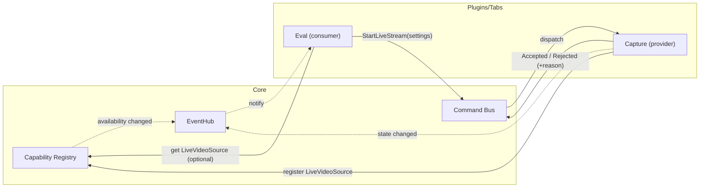

# Core systems (V2)

This page describes the core coordination primitives V2 is standardising on.

## Event hub

Use the event hub for **broadcast** updates (low-rate state changes and
notifications) that multiple tabs/services may need to react to.

- Good fits: “active project changed”, “media discovered”, “annotations changed”.
- Avoid: high-rate payloads like video frames.

## Plugin interoperability

V2 uses two complementary mechanisms (documented in more detail under
:doc:`plugins/index`):

1. **Capability registry**: share data/services without importing other plugins.
2. **Command bus**: request actions from other plugins with explicit accept/reject.

### Why not “fetch the other plugin’s widget and grab frames”?

Widgets are great as *views*, but they are a poor cross-plugin data API:

- Tight coupling to UI internals and lifecycles.
- Hard to handle “provider offline” cleanly.
- `grab()`-style screenshots are expensive and can be wrong with GPU/backing-store.

If shared UI is needed, expose a **widget factory** capability (e.g.
`create_preview_widget(parent)`), while still getting pixels from the underlying
data capability.

## Persistence queue

For background, non-blocking saves, prefer the shared persistence queue pattern
used in V1 (merge → snapshot → async write) and keep the domain payloads
immutable at the snapshot boundary.

## Theming + palette

V2 follows V1’s palette-driven “two tone” surfaces:

- Window backgrounds derive from `theme.secondary_color` (`QPalette.Window`)
- Viewports (lists/trees/inputs) derive from `QPalette.Base` / `AlternateBase`
- Selection highlight derives from `theme.tertiary_color` (`QPalette.Highlight`)

The entrypoint is `datalens.ui.theme.app_theme.AppTheme.apply_to(QApplication)`
(also exposed as `datalens.ui.theme.palette.apply_palette(app, theme)`).

## Settings store

V2 persists lightweight app/plugin settings in `settings.json` (per user).

- Schema: `datalens.domain.settings.AppSettings`
- IO helpers: `datalens.services.settings_store.SettingsStore`
- Coalesced background writes: `datalens.services.settings_store.DebouncedSettingsWriter`
