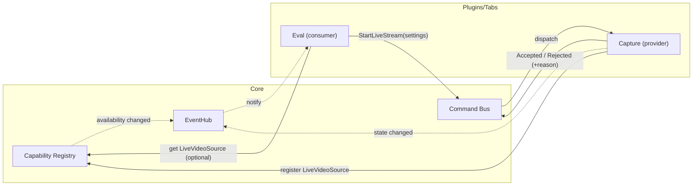

# Core systems (V2)

This page describes the core coordination primitives V2 is standardising on.

## Event hub

Use the event hub for **broadcast** updates (low-rate state changes and
notifications) that multiple tabs/services may need to react to.

- Good fits: “active project changed”, “media discovered”, “annotations changed”.
- Avoid: high-rate payloads like video frames.

## Capabilities (provider registry)

Use **capabilities** for *shared providers* (objects/functions) that other plugins/systems can discover
without importing each other or reaching into each other's DB tables.

- A plugin registers a provider under a stable string id, for example `widget_test.counter`.
- Consumers look up the provider via `app_ctx.capabilities.get("widget_test.counter")`.
- Multiple providers can exist for the same id; highest `priority` wins.

This is a coordination mechanism (not a security boundary).

Example (provider registration in `on_load`):

```python
from datalens.services.capabilities import CapabilityProvider

ctx.app.capabilities.register(
    CapabilityProvider(
        capability_id="widget_test.counter",
        provider=my_counter_provider,
        owner_plugin_id=self.plugin_id,
        description="Shared counter demo capability.",
    ),
    replace_owner=True,
)
```

Example (consumer usage):

```python
provider = app_ctx.capabilities.get("widget_test.counter")
if provider is not None:
    print(provider.get())
```

## Commands (request/response bus)

Use **commands** for request/response style coordination (a caller asks for something and receives a result).

- Commands run on a background threadpool by default: safe to call from the UI thread.
- The caller gets a `Future` and must not block the UI thread waiting for it.
- Plugin disable/unload can remove its handlers (`unregister_owner`).

Example (handler registration in `on_load`):

```python
from datalens.services.commands import RegisteredHandler

ctx.app.commands.register(
    RegisteredHandler(
        command_id="widget_test.echo",
        handler=lambda cmd: {"echo": cmd.payload},
        owner_plugin_id=self.plugin_id,
    ),
    replace=True,
)
```

Example (dispatch + UI-safe completion):

```python
fut = app_ctx.commands.dispatch("widget_test.echo", {"hello": "world"})

def done():
    print(fut.result())

# Use Qt queued delivery (QTimer.singleShot(0, done)) or a signal to marshal to the UI thread.
```

## Runtime context (AppContext)

V2 uses a small runtime context object to hold process resources and shared services:

- `AppContext` (runtime singleton): `datalens.core.context.AppContext`
- `ProjectContext` (per-open-project): `datalens.core.context.ProjectContext`

### Singleton access

Within a running Qt application, there must be exactly one `AppContext` stored on the
`DatalensApplication` instance.

- Bootstrap: `datalens.core.context.create_app_context(theme)` is a factory and raises if an
  `AppContext` already exists on the current `QApplication`.
- Access: `datalens.core.context.get_app_context()` returns the singleton from `QApplication.instance()`.

Best practice:
- UI code may call `get_app_context()` for convenience.
- Service code should still accept/receive `app_ctx` explicitly (keeps lifetimes and testing clearer).

## Plugin interoperability

V2 uses two complementary mechanisms (documented in more detail under
:doc:`plugins/index`):

1. **Capability registry**: share data/services without importing other plugins.
2. **Command bus**: request actions from other plugins with explicit accept/reject.

## Sharing contract: events vs capabilities vs commands

These three mechanisms are intentionally distinct. Use them consistently so plugins
stay decoupled and the UI stays responsive.

- **Events** (`EventHub`): broadcast *notifications* (“X happened”) with low-rate payloads.
  - Example: “active project changed”, “focused workspace changed”.
  - Subscribers must be fast; heavy work must be explicitly offloaded.
- **Capabilities** (`CapabilityRegistry`): publish *providers* (“here is a service/value you can query”).
  - Example: `capture.live_source` provider, `models.catalog` provider.
  - Consumers must treat capabilities as optional and handle “provider offline”.
- **Commands** (`CommandBus`): request/response *actions* (“please do X”) without imports.
  - Example: “start stream”, “open project”, “export dataset”.
  - Commands execute off the UI thread; callers must not block waiting for results.



### Why not “fetch the other plugin’s widget and grab frames”?

Widgets are great as *views*, but they are a poor cross-plugin data API:

- Tight coupling to UI internals and lifecycles.
- Hard to handle “provider offline” cleanly.
- `grab()`-style screenshots are expensive and can be wrong with GPU/backing-store.

If shared UI is needed, expose a **widget factory** capability (e.g.
`create_preview_widget(parent)`), while still getting pixels from the underlying
data capability.

## Persistence queue

For background, non-blocking saves, prefer the shared persistence queue pattern
used in V1 (merge → snapshot → async write) and keep the domain payloads
immutable at the snapshot boundary.

## Loader runner (long tasks + cancellation)

Use the loader runner for any long-running operation that needs UX feedback
without blocking the UI thread.

- API: `datalens.infra.background.loader_runner.run_with_loader`
- Task signature: `def task(ctx: LoaderContext) -> Any`

### Cooperative cancellation

The loader supports cancellation, but it is **cooperative**:

- The UI can request cancel (shows a Cancel button).
- The running task must periodically check the token and stop itself.

Only enable the Cancel button when the task is actually cancellable (i.e. it
checks `ctx.is_cancel_requested()` / `ctx.raise_if_cancelled()` in loops). If
you don’t, the UI will show “Cancelling…” but nothing will happen until the
task naturally returns.

Enable the Cancel button:

```python
run_with_loader(
    parent=self,
    title="Discovering files…",
    task=discover_task,
    on_result=on_done,
    on_error=on_error,
    on_cancelled=lambda: log.info("Discovery cancelled"),
    dialog_options={
        # Only enable this if your task cooperatively checks the cancellation token.
        "cancelable": True,
        # Optional: attach attribution for easier debugging in logs.
        "log_context": {"operation": "file_discovery", "plugin_id": "capture"},
    },
)
```

With the above `log_context`, loader logs include `plugin=...` and `op=...` so you
can trace which system triggered a loader when debugging.

Write cancellable tasks like:

```python
def discover_task(ctx: LoaderContext) -> list[Path]:
    results: list[Path] = []
    for root, _, files in os.walk(project_root):
        ctx.raise_if_cancelled()
        for name in files:
            ctx.raise_if_cancelled()
            results.append(Path(root) / name)
    return results
```

If a task is blocked inside a single long call, it cannot be preempted; cancel
will only take effect once control returns to Python.

### Progress messages via logging

Within a loader task (or any function running under that loader), you can
publish user-facing status lines by logging with a progress flag:

```python
log.info("Indexing images…", extra={"progress": True})
```

When a loader dialog is active, this message is forwarded to the dialog and
also written to the normal log output. The loader dialog will show it as:

- `<plugin_id>: Indexing images…` (when `plugin_id` is available in log context)
- otherwise the logger name is used as a best-effort prefix.

This is intentionally opt-in. Do not mark high-rate logs as progress, or it
will spam the dialog.

## Theming + palette

V2 follows V1’s palette-driven “two tone” surfaces:

- Window backgrounds derive from `theme.background_color` (`QPalette.Window`)
- Viewports (lists/trees/inputs) derive from `QPalette.Base` / `AlternateBase`
- Selection highlight derives from `theme.tertiary_color` (`QPalette.Highlight`)

The entrypoint is `datalens.ui.theme.app_theme.AppTheme.apply_to(QApplication)`
(also exposed as `datalens.ui.theme.palette.apply_palette(app, theme)`).

## Settings store

V2 persists lightweight app/plugin settings in `settings.json` (per user).

- Schema: `datalens.domain.system.settings.AppSettings`
- IO helpers: `datalens.services.settings_store.SettingsStore`
- Coalesced background writes: `datalens.services.settings_store.DebouncedSettingsWriter`

## Logging

V2 uses a single, async logging pipeline that is safe for the UI thread and
adds attribution fields (layer/subsystem/execution/plugin id).

- Implementation: `datalens.core.logging`
- Plugin-facing overview: :doc:`plugins/logging`
