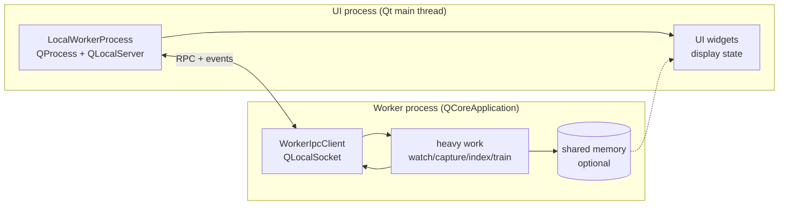

# Multiprocessing + IPC (V2)

DataLens V2 supports **in-process UI plugins** and **out-of-process worker plugins**.

This section documents the supported IPC building blocks so plugin authors can:

- keep the Qt UI thread responsive (no blocking work on UI callbacks)
- isolate heavy/unsafe work in separate processes (capture, indexing, training, watchers)
- stream data back to the UI safely

## What problem this solves

Python threads are great for I/O-bound background tasks, but they do not isolate
faults and they do not provide true parallelism for CPU-bound Python due to the
GIL. Moving heavy work into a **separate process** gives:

- real isolation (worker crash/hang doesn’t crash the UI process)
- true parallelism (separate interpreter + separate GIL)

## Overview: recommended architecture

Use a **hybrid** design:

- Control plane: `QLocalServer` / `QLocalSocket` (commands, events, small payloads)
- Data plane (optional): shared memory for high-rate binary payloads (frames), with
  socket notifications carrying only pointers/metadata

## Choosing an approach

- **Use local sockets only** when:
  - payloads are small/medium (events, file paths, progress, metadata)
  - you want the simplest implementation
- **Add shared memory** when:
  - you need low-latency / high-throughput streaming (camera frames, large tensors)
  - you’re hitting CPU or bandwidth limits with socket payload copies/codec overhead

## Cross-platform notes (Windows/macOS/Linux)

Qt local sockets are cross-platform:

- Windows: named pipes
- macOS/Linux: Unix domain sockets

Practical guidance:

- always remove stale endpoints before listen (crash recovery)
- keep server names short and ASCII-only
- treat shared memory cleanup as best-effort on shutdown (creator unlinks, readers close)

## Pages

- {doc}`processes` — process lifecycle with `QProcess` (start/stop, stdout/stderr, env)
- {doc}`local_socket` — `QLocalServer` / `QLocalSocket` control-plane protocol (RPC + events)
- {doc}`shared_memory` — shared memory “data plane” + socket notifications (high-rate payloads)

