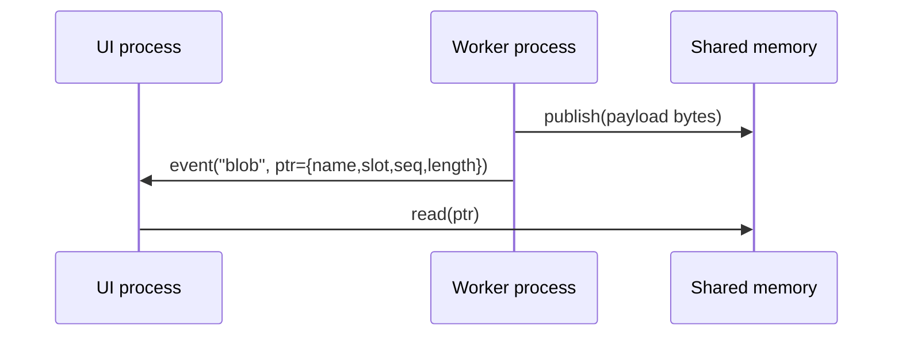

# Shared memory + local socket notifications

Use shared memory when you need to stream **large payloads at high rate**
(camera frames, large tensors) without copying multi-MB buffers through the socket.

V2 provides a small helper:

- `datalens.infra.ipc.shared_memory.SharedMemoryLatestBuffer`

## How it works

- The worker creates a shared memory segment and publishes payloads into it.
- The worker sends a small socket event containing a `SharedMemoryPointer`.
- The UI process attaches to the shared memory and reads the bytes referenced by the pointer.



## Example: shared memory demo

Run:

```bash
python -m datalens.infra.ipc.examples.shm_host
```

Expected output (example):

```text
[host] worker connected
[host] blob #1
[host] blob #2
[host] blob #3
```

## Frame streaming contract (recommended)

For video frames, send metadata in the socket message header/event data:

- `width`, `height`
- `pixel_format` (e.g. `BGRA8888`, `RGB888`, `GRAY8`)
- `stride_bytes`
- `timestamp`
- `ptr` (the `SharedMemoryPointer` dict)

Then the UI converts bytes into a `QImage` (usually by copying into UI-owned memory).

## Pros / cons

Pros:

- low latency and high throughput
- avoids repeated socket copies of large buffers

Cons:

- more moving parts (lifecycle, cleanup, slot sizing)
- “latest wins” semantics by default (you can drop frames if the UI lags)

## Backpressure and dropping (recommended)

For real-time preview, it is usually better to **drop** frames than to build an
unbounded queue:

- worker publishes at camera rate
- UI renders “latest available” (may skip frames under load)

Practical knobs:

- increase `slot_count` to tolerate UI lag without overwriting the slot too quickly
- throttle notifications (e.g. notify at 30 FPS even if capture is 60 FPS)
- send only keyframes/downsized previews for UI; keep full-res frames for recording
