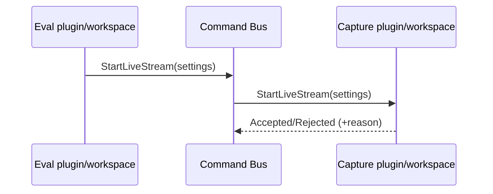

# Commands (cross-plugin requests)

Commands provide request/response messaging between plugins without direct
imports.

## When to use commands

- start/stop streaming
- change provider settings
- open/activate provider feature

## Design guidelines

- Commands are **typed** (dataclasses) and versioned via the plugin API surface.
- Handlers should be **idempotent** where practical (repeat requests are safe).
- Responses should be explicit:
  - accepted / rejected
  - optional reason string for user-facing errors

## Example: Eval requests Capture

