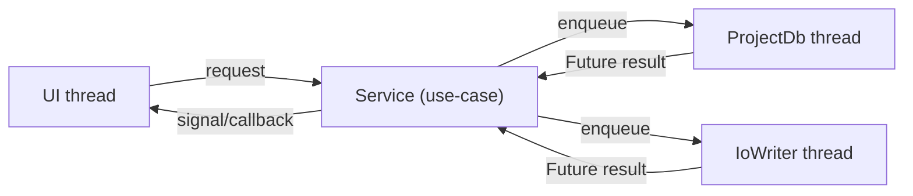

# Services (application layer)

V2 uses **services** as the application layer: they coordinate domain objects,
runtime resources (DB, background threads), and UI workflows without putting
business logic into widgets.

Services are the place to implement "use-cases" such as:

- open/close a project
- read/write project state without blocking the UI
- persist user settings safely

## How services are accessed

Services are not global singletons that plugins import directly. The host
creates runtime context objects and injects them:

- `datalens.core.context.AppContext` (shared app runtime state)
- `datalens.core.context.ProjectContext` (project-scoped runtime state)

Project access is gated:

- `ctx.active_project is None` means no project is open.
- `ctx.require_project()` raises `NoActiveProjectError` if no project is open.

## Threading model (non-blocking UI)

Rule: the UI thread must not block on IO.

In V2, IO work is pushed to background executors:

- SQLite work runs on the project DB executor thread (`ProjectDb`).
- File writes run on a background IO thread (`IoWriter`) for small/medium payloads.

If a service returns a `Future`, UI code must attach a callback (or use a loader
stage) rather than calling `.result()` on the UI thread.

## Background IO (`datalens.services.background_io`)

Use `IoWriter` for non-blocking file writes that are:

- small/medium (JSON, manifests, caches, exports)
- safe to write atomically (tmp + replace)

Key APIs:

- `IoWriter.write_json_atomic(path, payload)`
- `IoWriter.write_text_atomic(path, text)`
- `IoWriter.write_bytes_atomic(path, data)`

What not to use it for:

- high-throughput frame recording (PNG sequences, video encoding). Those need a
  dedicated capture pipeline with bounded queues and backpressure.

## Project DB (`datalens.services.db`)

The project DB is a single SQLite database per project:

- `<project_root>/.datalens/project.sqlite`

Plugins persist project state via `ProjectDb`:

- `execute_write(fn(conn)) -> Future`
- `execute_read(fn(conn)) -> Future`
- `kv_get(plugin_id, key) -> Future[object | None]`
- `kv_set(plugin_id, key, value) -> Future[None]`

### Core vs plugin ownership (safety)

Core-owned tables (reserved):

- `app_meta`
- `plugin_kv`

Core code must never modify plugin-owned tables. Plugins manage their own tables
and migrations.

### Readiness

`SqliteProjectDb` initializes asynchronously and exposes `ready()`.

Services that open a project must wait for readiness **off the UI thread**
(typically using the loader dialog stage), then attach the `ProjectContext` to
`AppContext`.

## Projects (`datalens.services.project_service`)

The project service owns the project lifecycle use-case:

- load/open a project
- close the active project
- attach/detach `ProjectContext` in `AppContext` (gating)

The app should open projects in background stages:

- inspect project layout (fast)
- initialize/migrate core DB schema (DB thread)
- set active project
  - optionally write derived metadata (IO thread, best effort)

### Project close (plugin-aware flush)

When closing a project (or exiting), the host must flush in this order:

1. plugin/service flush hooks (so they can enqueue final DB writes)
2. `ProjectDb.flush()` (commit queued transactions)
3. `IoWriter.flush()` (commit queued file writes)
4. close resources

Plugins/services that own their own background pipelines should register a close
hook on `AppContext` via:

- `AppContext.register_project_flush_hook(hook)`

## Settings (`datalens.services.settings_store` + `datalens.services.config_service`)

User settings are stored per user (not per project) in `settings.json`:

- schema: `datalens.domain.settings.AppSettings`

Helpers:

- `SettingsStore` provides atomic `load -> mutate -> save`.
- `DebouncedSettingsWriter` coalesces frequent updates (toggles/sliders) to
  avoid disk churn.

Long-term: we may unify settings IO onto the same `IoWriter` to keep "file writes
go through one system" consistent, but the semantics (debounce + file locking)
must remain.
